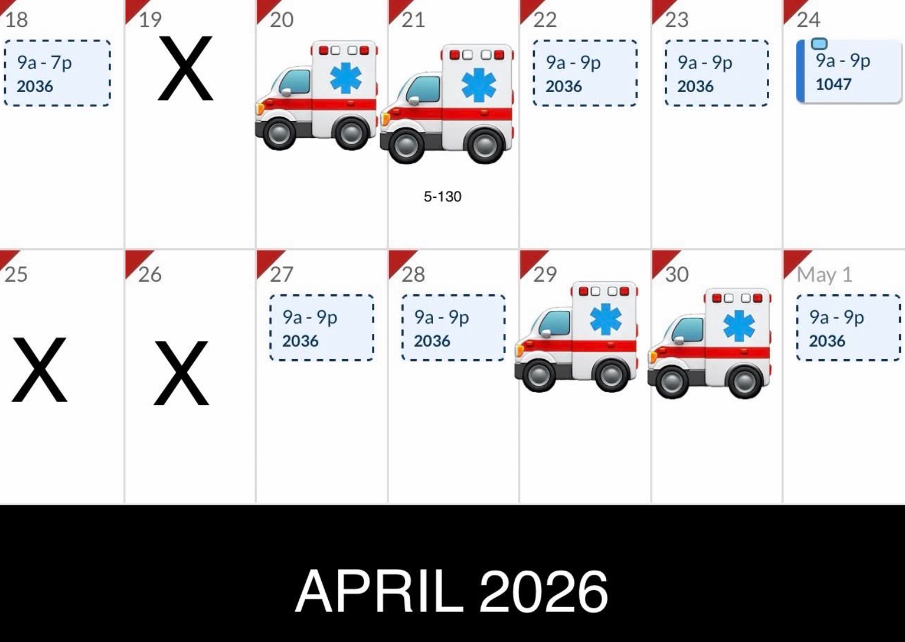
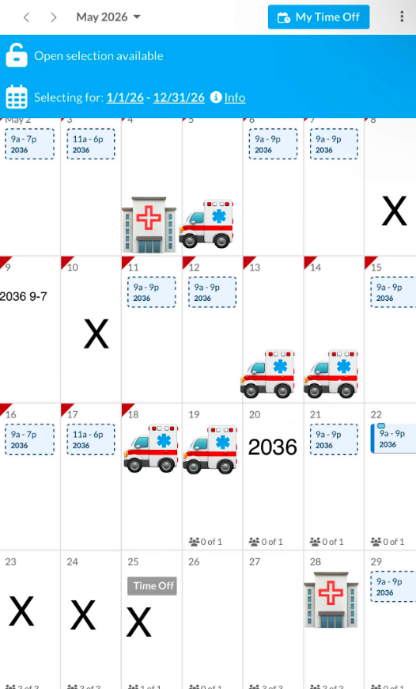

# Project 3: Persons Required

 
# 🚑 The Ambulance Sticker Problem: Six Roles, Three Hospitals, One Very Messy System
 
> *"The schedule tells him where to be. This tool tells him whether he can also be everything else."*
 
---

# Design Argument & Research
 
This is a pre-AI UX design thesis documenting a real person, a real problem, and a grounded definition of what being "helped" actually means. Every claim here comes directly from interviews, screenshots, observations, or documented behavior. Nothing is made up for the sake of the project.
 
---
 
# Section 1: The Person
 
**Johnny Truong** is a 35-year-old Vietnamese-American man living outside Nashville, Tennessee.
 
On any given week, he’s balancing shifts across three different hospital systems while also juggling multiple other responsibilities:
 
| Role | Employer |
|---|---|
| Pharmacist | Publix |
| Pharmacist | Vanderbilt Hospital |
| Pharmacist | Nashville General Hospital |
| Real Estate Agent | Independent |
| Nail Shop Co-Owner | Independent |
| Father | Family |
 
He isn’t bad at organization. The problem is that none of the systems he relies on were designed to work together. Every employer has its own scheduling platform, login flow, and two-factor authentication. None of them sync. Johnny ends up managing the gaps between all of them manually.
 
### By the Numbers
 
| | |
|---|---|
| **6** | Concurrent roles across employers |
| **3** | Separate hospital scheduling systems |
| **1–2 months** | How far ahead schedules are usually sent |
 
---
 
# Section 2:  The Problem
 
Johnny struggles to manage a constantly changing schedule across multiple employers, all using separate systems, separate logins, and separate verification steps. Even just seeing everything in one place becomes a task on its own.
 
## Research Documentation
 

### In His Own Words
 
> *"Different logins. Different passwords. Two factor authentications."*
> — On what's hardest about switching between hospital systems
 
> *"When things change last minute I have to basically paint/photoshop my shit lol."*
> — On schedule changes
 
> *"Ease, frequency of changes, lack of drive to look for something better."*
> — On why he sticks with screenshots
 
> *"Habit."*
> — The single word that explains the whole system
 
> *"There's probably a calendar app for all this. I just haven't had the time to look."*
> — On awareness of alternatives
 
> *"My problems revolve around commute times and making sure I got the necessary time/bandwidth to take care of the things I need to do."*
> — On what the actual problem is underneath everything else
 
### Observed Artifacts
 
**The Calendar**  
Johnny screenshots his Publix scheduling app, then manually places ambulance emoji stickers over dates to mark Vanderbilt and Nashville General shifts. Days off get hand-drawn X’s. This becomes his main scheduling interface.

<table>
<tr>
<td></td>
<td></td>
</tr>
</table>
 
**The Task System**  
For reminders, Johnny texts himself and edits or crosses things out directly in the message thread. No dedicated productivity app. No connection between tasks and the actual shifts they relate to.
 
### Pain Points
 
| # | Pain Point |
|---|---|
| 01 | The hardest mental task every week is **remembering which facility he’s commuting to**  not the pharmacy work itself, just the logistics around it |
| 02 | He only checks schedules **once a week or right before a shift** because checking more often means logging into three different systems repeatedly |
| 03 | Last-minute schedule changes break the entire workaround system — screenshots become outdated and need manual edits |
| 04 | Tasks live completely separate from scheduling — **there’s no connection between what he needs to do and when he realistically has time to do it** |

### All Direct Quotes
 
| Quote | Context |
|---|---|
| *"Different logins. Different passwords. Two factor authentications."* | On switching between hospital systems |
| *"When things change last minute I have to basically paint/photoshop my shit lol."* | On schedule changes |
| *"Ease, frequency of changes, lack of drive to look for something better."* | On why he uses screenshots |
| *"Habit."* | The single-word explanation |
| *"There's probably a calendar app for all this. I just haven't had the time to look."* | On awareness of alternatives |
| *"Remembering which facility im going to."* | His biggest source of mental effort |
| *"I text myself reminders/lists and edit or cross out."* | His task management system |
| *"It would be cool to have something that I can differentiate my days then when I click on the day I can add tasks to do and cross them off as I go."* | His direct feature request |
| *"My problems revolve around commute times and making sure I got the necessary time/bandwidth to take care of the things I need to do."* | The real underlying problem |
 
---
 
## Section 3 : The Listening Plan
 
This wasn’t approached like a one-and-done interview. Johnny’s situation changes weekly. Shifts move around, commutes vary, and new friction points show up constantly.
 
### Research Cadence
 
| Format | Frequency | Purpose |
|---|---|---|
| Text check-ins | 3× per week | Capture real-time friction, updates, and recurring pain points |
| Scheduled call | 1× per week | Longer conversations around root problems and feature feedback |
| Natural observation | Ongoing | Observing how he actually interacts with schedules after shifts or during downtime |
 
### Research Ethics
-  Clear consent obtained before research began
-  Permission granted to take notes and reference quotes
-  Permission granted to use his information for this project
-  Research conducted during natural moments, not staged ones
---
 
#  Section 4 : What Help Looks Like
 
Johnny defined this himself without prompting:
 
> *"It would be cool to have something that I can differentiate my days then when I click on the day I can add tasks to do and cross them off as I go."*
> — Johnny Truong, direct feature request
 
> *"Less stressful? Cause planned out further ahead and more accurate if it could update all 3 schedules in real time. Accuracy. Editable. Customizable. Fun."*
> — On what a better system would actually feel like
 
### Defensible Definition of "Helped"
 
**Johnny feels helped when he can open one screen the night before work and immediately know  without logging into three systems or mentally piecing things together  where he’s working, how long the commute will take, and whether he realistically has time for anything else that day.**
 
Tasks live directly on the day they belong to. If a shift changes, the schedule updates automatically. No more photoshopping ambulance stickers at 10pm.
 
---

# Section 5 : The Thesis

**Johnny Truong doesn't have a scheduling problem. He has a translation problem  six roles, three hospital systems, and no single surface that speaks all of them at once. Every workaround he's built, the ambulance stickers, the self-texts, the photoshopped screenshots, is evidence of someone filling a gap that software left open. This project eliminates that gap by turning raw schedule screenshots into structured, unified calendar events — with commute awareness, day-level tasks, and employer context built in  so that the night before a shift, Johnny opens one screen and already knows everything he needs to know.**

---
 
# Section 6 : The Approach
 
A **screenshot-to-schedule calendar app** that uses character recognition to pull shift details from uploaded screenshots and automatically convert them into structured events across multiple calendars in one unified view.
 
### Core Features
 
**OCR Screenshot Ingestion**  
Upload or capture a schedule screenshot and the app automatically reads the information and creates calendar events without needing manual re-entry.
 
**Employer Tagging**  
Every event gets tagged by employer (Vanderbilt, Nashville General, Publix) using visual color indicators so Johnny can scan an entire month view and immediately understand where he’s going.
 
**Day-Level Task Lists**  
Tap on a day, add tasks, and check them off throughout the day  directly connected to the shift instead of floating in a separate notes app or text thread.
 
**Drag-and-Reschedule with Version History**  
When shifts change last minute, updates are fast and reversible without needing new screenshots or sticker edits.
 
**Commute-Aware Alerts**  
A real-time "leave now" notification based on current location, destination facility, and live traffic conditions so commute calculations stop living in his head.
 
---
 
# Section 7 : Position Going In
 
The core position: **eliminate the manual workaround loop**  the screenshots, stickers, edits, and mental tracking  by turning raw schedule information into structured, usable calendar events automatically. The user shouldn’t have to manage the same schedule twice.
 
### Assumptions & Open Questions
 
| | |
|---|---|
|  **Open Question** | Can a lightweight app reliably support real-time commute notifications? This is where trust matters most — if notifications fail, the system fails |
|  **Technical Concern** | What happens if the app is offline? Missing commute alerts in a time-sensitive workflow could mean missing shifts entirely |
|  **Design Assumption** | Johnny already assumes a better solution probably exists. The issue isn’t awareness — it’s having enough time or energy to set something complicated up |
|  **Success Metric** | Johnny stops texting himself reminders. Johnny stops editing screenshots. Johnny checks one screen instead of three. Observable. Measurable. |
 
---
 
# Section 8 : What This Project Is Not
 
- **Not an offline-first machine** — Internet access is required for real-time traffic, commute alerts, and schedule syncing. Offline support is currently outside scope.
- **Not a replacement for employer systems** — Cannot remove login requirements, two-factor authentication, or hospital restrictions imposed by Vanderbilt, Nashville General, or Publix. The tool works *around* existing systems, not *through* them.
- **Not a generic productivity app** — This is designed specifically around Johnny’s multi-employer, multi-commute lifestyle. Not productivity for everyone — support for one documented workflow.
- **Not speculative** — Every feature connects directly back to something Johnny said or something observed in real behavior. If there’s no evidence for it, it doesn’t belong here.

---

# Section 9 : Platform Rationale
 
**React + Vite + Tailwind PWA  deployed on Github Pages installable to iPhone home screen by PWA, Progressive Web App.**
 
Every choice traces back to Johnny:
 
| Decision | Why |
|---|---|
| **PWA not native iOS** | Outside build constraints. PWA installs to home screen, works fullscreen, sends lock screen notifications via OneSignal on iOS 16.4+ |
| **Responsive, not mobile-only** | He uses his laptop at work to set up his week. He uses his iPhone while walking between locations. Two modes, one app. |
| **React + Vite** | Component structure maps directly to the UI: month view, shift cards, task lists — each discrete, stateful |
| **Tailwind** | He said *"fun, customizable, colorful."* Tailwind makes rapid visual iteration fast |
| **Vercel** | One-click deploy from GitHub. Johnny gets a URL, opens in Safari, adds to home screen in under a minute |
| **OneSignal** | Commute alerts need to hit a locked screen. OneSignal handles server-side scheduling without a backend |
 
> *Johnny manages his schedule on his laptop at work and checks it on his iPhone while walking  the app needs to be fully functional on both, with a setup mode on desktop and a glance mode on mobile.*
*Primary Research conducted April-May 2026 · UX Research Thesis*

---

# Section 10 : Prototype Process

 
