# Project 3: Persons Required

 
# 🚑 The Ambulance Sticker Problem: Six Roles, Three Hospitals, One Very Messy System
 
> *"The schedule tells him where to be. This tool tells him whether he can also be everything else."*
 
---

# Design Argument & Research
 
This is a pre-AI UX design thesis documenting a real person, a real problem, and a grounded definition of what being "helped" actually means. Every claim here comes directly from interviews, screenshots, observations, or documented behavior. Nothing is made up for the sake of the project.
 
---
 
# Section 1: The Person
 
**Johnny Truong** is a 35-year-old Vietnamese-American man living outside Nashville, Tennessee.
 
On any given week, he’s balancing shifts across three different hospital systems while also juggling multiple other responsibilities:
 
| Role | Employer |
|---|---|
| Pharmacist | Publix |
| Pharmacist | Vanderbilt Hospital |
| Pharmacist | Nashville General Hospital |
| Real Estate Agent | Independent |
| Nail Shop Co-Owner | Independent |
| Father | Family |
 
He isn’t bad at organization. The problem is that none of the systems he relies on were designed to work together. Every employer has its own scheduling platform, login flow, and two-factor authentication. None of them sync. Johnny ends up managing the gaps between all of them manually.
 
### By the Numbers
 
| | |
|---|---|
| **6** | Concurrent roles across employers |
| **3** | Separate hospital scheduling systems |
| **1–2 months** | How far ahead schedules are usually sent |
 
---
 
# Section 2:  The Problem
 
Johnny struggles to manage a constantly changing schedule across multiple employers, all using separate systems, separate logins, and separate verification steps. Even just seeing everything in one place becomes a task on its own.
 

## Research Documentation
 

### In His Own Words
 
> *"Different logins. Different passwords. Two factor authentications."*
> — On what's hardest about switching between hospital systems
 
> *"When things change last minute I have to basically paint/photoshop my shit lol."*
> — On schedule changes
 
> *"Ease, frequency of changes, lack of drive to look for something better."*
> — On why he sticks with screenshots
 
> *"Habit."*
> — The single word that explains the whole system
 
> *"There's probably a calendar app for all this. I just haven't had the time to look."*
> — On awareness of alternatives
 
> *"My problems revolve around commute times and making sure I got the necessary time/bandwidth to take care of the things I need to do."*
> — On what the actual problem is underneath everything else

### His Current System
```
Screenshot Publix calendar (Science Provider app)
  → Manually place 🚑 emoji stickers on dates for Vanderbilt + Nashville General
    → Mark days off with X
      → Text himself task reminders
        → Cross them out in the iMessage thread
        
```

### Observed Artifacts
 
**The Calendar**  
Johnny screenshots his Publix scheduling app, then manually places ambulance emoji stickers over dates to mark Vanderbilt and Nashville General shifts. Days off get hand-drawn X’s. This becomes his main scheduling interface.

<table>
<tr>
<td>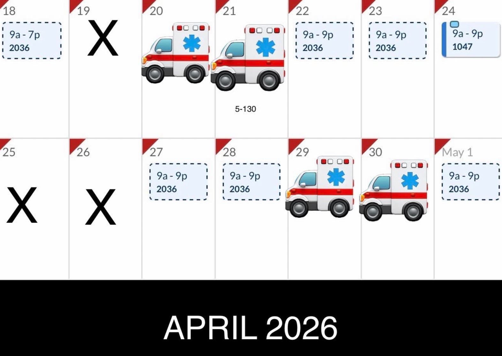</td>
<td>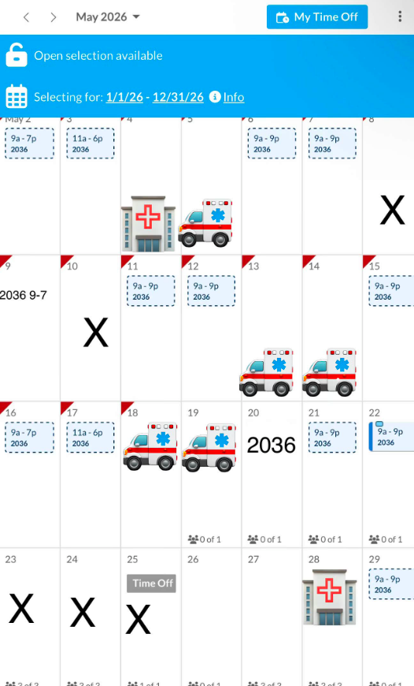</td>
</tr>
</table>
 
**The Task System**  
For reminders, Johnny texts himself and edits or crosses things out directly in the message thread. No dedicated productivity app. No connection between tasks and the actual shifts they relate to.
 
### Pain Points
 
| # | Pain Point |
|---|---|
| 01 | The hardest mental task every week is **remembering which facility he’s commuting to**  not the pharmacy work itself, just the logistics around it |
| 02 | He only checks schedules **once a week or right before a shift** because checking more often means logging into three different systems repeatedly |
| 03 | Last-minute schedule changes break the entire workaround system — screenshots become outdated and need manual edits |
| 04 | Tasks live completely separate from scheduling — **there’s no connection between what he needs to do and when he realistically has time to do it** |

### All Direct Quotes
 
| Quote | Context |
|---|---|
| *"Different logins. Different passwords. Two factor authentications."* | On switching between hospital systems |
| *"When things change last minute I have to basically paint/photoshop my shit lol."* | On schedule changes |
| *"Ease, frequency of changes, lack of drive to look for something better."* | On why he uses screenshots |
| *"Habit."* | The single-word explanation |
| *"There's probably a calendar app for all this. I just haven't had the time to look."* | On awareness of alternatives |
| *"Remembering which facility im going to."* | His biggest source of mental effort |
| *"I text myself reminders/lists and edit or cross out."* | His task management system |
| *"It would be cool to have something that I can differentiate my days then when I click on the day I can add tasks to do and cross them off as I go."* | His direct feature request |
| *"My problems revolve around commute times and making sure I got the necessary time/bandwidth to take care of the things I need to do."* | The real underlying problem |
 
---
 
## Section 3 : The Listening Plan
 
This wasn’t approached like a one-and-done interview. Johnny’s situation changes weekly. Shifts move around, commutes vary, and new friction points show up constantly.
 
### Research Cadence
 
| Format | Frequency | Purpose |
|---|---|---|
| Text check-ins | 3× per week | Capture real-time friction, updates, and recurring pain points |
| Scheduled call | 1× per week | Longer conversations around root problems and feature feedback |
| Natural observation | Ongoing | Observing how he actually interacts with schedules after shifts or during downtime |
 
### Research Ethics
-  Clear consent obtained before research began
-  Permission granted to take notes and reference quotes
-  Permission granted to use his information for this project
-  Research conducted during natural moments, not staged ones
---
 
#  Section 4 : What Help Looks Like
 
Johnny defined this himself without prompting:
 
> *"It would be cool to have something that I can differentiate my days then when I click on the day I can add tasks to do and cross them off as I go."*
> — Johnny Truong, direct feature request
 
> *"Less stressful? Cause planned out further ahead and more accurate if it could update all 3 schedules in real time. Accuracy. Editable. Customizable. Fun."*
> — On what a better system would actually feel like
 
### Defensible Definition of "Helped"
 
**Johnny feels helped when he can open one screen the night before work and immediately know  without logging into three systems or mentally piecing things together  where he’s working, how long the commute will take, and whether he realistically has time for anything else that day.**
 
Tasks live directly on the day they belong to. If a shift changes, the schedule updates automatically. No more photoshopping ambulance stickers at 10pm.
 
---

# Section 5 : The Thesis

**Johnny Truong doesn't have a scheduling problem. He has a translation problem  six roles, three hospital systems, and no single surface that speaks all of them at once. Every workaround he's built, the ambulance stickers, the self-texts, the photoshopped screenshots, is evidence of someone filling a gap that software left open. This project eliminates that gap by turning raw schedule screenshots into structured, unified calendar events — with commute awareness, day-level tasks, and employer context built in  so that the night before a shift, Johnny opens one screen and already knows everything he needs to know.**

---
 
# Section 6 : The Approach
 
A **screenshot-to-schedule calendar app** that uses character recognition to pull shift details from uploaded screenshots and automatically convert them into structured events across multiple calendars in one unified view.
 
### Core Features
 
| Feature | Grounded In |
|---|---|
| 📸 **Screenshot → OCR → Auto-populate** | *"Sounds annoying to manually add lol"* + his entire workaround is screenshot-based |
| 🏷️ **Employer color tags on month view** | *"Differentiate my days"* |
| 📅 **Day/shift card with big time display** | *"When I click on the day"* + *"Yes to shift times"* |
| ✅ **Per-shift task checklist** | *"Add tasks to do and cross them off as I go"* |
| 🚗 **Commute-aware leave alert** | *"My problems revolve around commute times"* |
| 🔔 **OneSignal lock screen notification** | Commute alerts need to reach a locked screen |
| ↔️ **Drag-to-reschedule** | *"Paint/photoshop my shit"* when things change |
| 📱 **Installable to iPhone home screen** | He checks it while walking between locations |
 
---
 
# Section 7 : Position Going In
 
The core position: **eliminate the manual workaround loop**  the screenshots, stickers, edits, and mental tracking  by turning raw schedule information into structured, usable calendar events automatically. The user shouldn’t have to manage the same schedule twice.
 
### Assumptions & Open Questions
 
| | |
|---|---|
|  **Open Question** | Can a lightweight app reliably support real-time commute notifications? This is where trust matters most — if notifications fail, the system fails |
|  **Technical Concern** | What happens if the app is offline? Missing commute alerts in a time-sensitive workflow could mean missing shifts entirely |
|  **Design Assumption** | Johnny already assumes a better solution probably exists. The issue isn’t awareness — it’s having enough time or energy to set something complicated up |
|  **Success Metric** | Johnny stops texting himself reminders. Johnny stops editing screenshots. Johnny checks one screen instead of three. Observable. Measurable. |
 
---
 
# Section 8 : What This Project Is Not
 
- **Not an offline-first machine** — Internet access is required for real-time traffic, commute alerts, and schedule syncing. Offline support is currently outside scope.
- **Not a replacement for employer systems** — Cannot remove login requirements, two-factor authentication, or hospital restrictions imposed by Vanderbilt, Nashville General, or Publix. The tool works *around* existing systems, not *through* them.
- **Not a generic productivity app** — This is designed specifically around Johnny’s multi-employer, multi-commute lifestyle. Not productivity for everyone — support for one documented workflow.
- **Not speculative** — Every feature connects directly back to something Johnny said or something observed in real behavior. If there’s no evidence for it, it doesn’t belong here.

---


# Section 9 : Platform Rationale
 
**React + Vite + Tailwind PWA  deployed on Github Pages installable to iPhone home screen by PWA, Progressive Web App.**
 
Every choice traces back to Johnny:
 
| Decision | Why |
|---|---|
| **PWA not native iOS** | Outside build constraints. PWA installs to home screen, works fullscreen, sends lock screen notifications via OneSignal on iOS 16.4+ |
| **Responsive, not mobile-only** | He uses his laptop at work to set up his week. He uses his iPhone while walking between locations. Two modes, one app. |
| **React + Vite** | Component structure maps directly to the UI: month view, shift cards, task lists — each discrete, stateful |
| **Tailwind** | He said *"fun, customizable, colorful."* Tailwind makes rapid visual iteration fast |
| **Githubpages** | One-click deploy from GitHub. Johnny gets a URL, opens in Safari, adds to home screen in under a minute |
| **OneSignal** | Commute alerts need to hit a locked screen. OneSignal handles server-side scheduling without a backend |
 
> *Johnny manages his schedule on his laptop at work and checks it on his iPhone while walking  the app needs to be fully functional on both, with a setup mode on desktop and a glance mode on mobile.*
*Primary Research conducted April-May 2026 · UX Research Thesis*

---

# Section 10 : Prototype Style

 
## Visual Style
 
| Decision | Source |
|---|---|
| **Dark mode only** | *"Dark mode"* — his direct answer |
| **Bold distinct color per employer** | *"Different colors for different jobs would be nice"* |
| **Shift times as visual hero** | *"Yes to shift times"* |
| **Fun, personality-forward** | Said *"fun."* Has never used a calendar app before no competing aesthetic to match |
| **No manual entry as default** | *"Sounds annoying to manually add lol"* |

### Employer Colors
 
| Employer | Color | Hex |
|---|---|---|
| 🟢 Publix | Green | `#00A651` |
| 🟡 Vanderbilt | Gold | `#CFB87C` |
| 🔵 Nashville General | Blue | `#2D6DB5` |
| ⚫ Personal / Off | Gray | `#3A3A3A` |

### Typography
 
| Use | Font | Weight |
|---|---|---|
| App name / display | Syne | 800 |
| Shift times (hero element) | Syne | 800 · 42px minimum |
| Employer names / headings | Syne | 700 |
| Body / UI / labels | Space Grotesk | 400 · 500 |


---

# Section 11 : User Testing
Johnny did not feel comfortable having his face photographed or recorded during user testing. To respect his privacy and maintain research ethics, documentation focused on screen recordings, interaction notes, interface observations, direct quotes, and workflow behaviors rather than identifiable imagery of the participant.

## First Click Through
**May 9, 2026 · iPhone 14 + laptop · in-person session**

Johnny tested the prototype on both devices in the same session — mobile first, then laptop. He used his own iPhone throughout the mobile portion. The laptop portion was on a MacBook used specifically to observe desktop behavior, since Johnny's primary concern coming in was whether the app would work the way he expected when he wasn't on his phone.

### User Testing Goals

1. Test whether Johnny can quickly understand his full schedule in one place without relying on screenshots or multiple apps.
2. Evaluate whether the prototype reduces stress and mental effort around commuting, shift tracking, and task management.
3. Identify usability issues involving navigation, schedule importing, and understanding interactions across desktop and mobile.
4. Measure how effectively employer colors, shift cards, and task features support Johnny’s real-world workflow.
5. Observe which features build or break trust, especially around OCR accuracy, schedule updates, and notifications.

### Task 1 Check Tomorrow’s Schedule

**Prompt**
Open the app and figure out where you are working tomorrow, what time your shift starts, and when you would need to leave.

**Questions**
What information did you notice first?
Was anything confusing when trying to understand tomorrow’s schedule?
Did the commute information feel helpful?
Would this be faster than your current screenshot method?

### Task 2 Check Tomorrow’s Schedule

**Prompt**
Use the calendar to explain what your upcoming week looks like across all jobs.

**Questions**
1. Was it easy to tell which shifts belonged to which employer?
2. Which days felt the busiest to you?
3. Did the colors help you mentally organize the week?
4. Was there any information you expected but couldn’t find?

### Task 3 Add and Complete a Task

**Prompt**
Add a realistic reminder or task to one of your workdays, then mark it as completed.

**Questions**
1. Is attaching tasks to a specific day feel natural?
2. Would you use this instead of texting yourself reminders?
3. What kinds of tasks would you realistically add here?
4. Did anything about the task system feel unnecessary or missing?

### Task 4 Handle a Schedule Change

**Prompt**
Pretend one of your hospital shifts changed last minute. Show how you would update or manage that change in the app.

**Questions**
1. What was the first thing you tried to do?
2. Did this feel easier than editing screenshots manually?
3. Would you trust the app to stay accurate after schedule changes?
4. What would make you trust the system more?

### Task 5 Mobile Glance Test

**Prompt**
Imagine you are walking between locations and quickly checking the app on your phone.

**Questions**
1. What information stood out immediately on mobile?
2. Did anything feel difficult to access quickly?
3. Would you realistically check this while on the move?
4. After using the prototype, what still feels stressful or unresolved about scheduling?

### User Testing Results

| Quote | Context |
|---|---|
| *"I like that I can finally see everything in one place instead of bouncing between apps."* | Positive reaction to unified scheduling |
| *"The colors actually help more than I thought they would."* | Reaction to employer color coding |
| *"The commute part is actually useful because that’s what stresses me out the most."* | Positive feedback on commute-aware features |
| *"I like that the shift times are big because that’s the main thing I care about."* | Reaction to visual hierarchy and readability |
| *"This already feels less chaotic than my current system."* | Overall emotional reaction to prototype organization |
| *"I kept looking for a navigation bar on desktop."* | Difficulty navigating desktop experience |
| *"I didn’t know where to go next on laptop because there wasn’t a clear menu."* | Navigation confusion during testing |
| *"Some of the screenshots imported correctly, but some shift times got messed up."* | OCR inconsistency across schedule screenshots |
| *"The screenshots that had weird formatting confused the scanner a little."* | OCR struggled with different hospital layouts |
| *"I still want a faster way to fix mistakes if the schedule imports wrong."* | User concern about OCR correction workflow |

Several features worked immediately without any explanation. Johnny navigated the mobile calendar, read the shift cards, and checked the commute timing without prompting. The employer color system landed immediately — he identified all three jobs at a glance and said it helped more than he expected. The large shift-time display (“that's the main thing I care about”) matched the hierarchy he actually uses when reading his current screenshots. The task checklist was understood on first tap; he said he would use it instead of texting himself reminders.

OCR importing was the clearest failure point. Two specific problems appeared: some screenshots produced wrong shift times (a start time imported as a different hour than what was on the schedule), and at least one screenshot dropped a shift entirely without any error message. Johnny noticed both failures immediately. The silent drop was worse than the wrong time — he had no way to know something was missing. This directly eroded trust: “I still want a faster way to fix mistakes if the schedule imports wrong.”

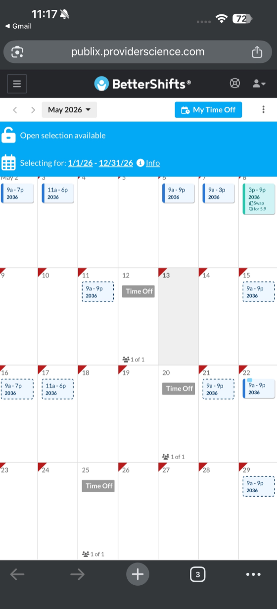
*The Science Provider (BetterShifts) screenshot Johnny uploaded during Round 1. Two specific failure modes: shorthand times like `9a - 7p` were misread because the OCR prompt had no rules for that format, and dashed-border unconfirmed shifts (visible throughout) were parsed as confirmed shifts or dropped entirely with no error message. Both were fixed before Round 2 by rewriting the Claude extraction prompt with explicit time-parsing rules and a dashed-border exclusion instruction.*

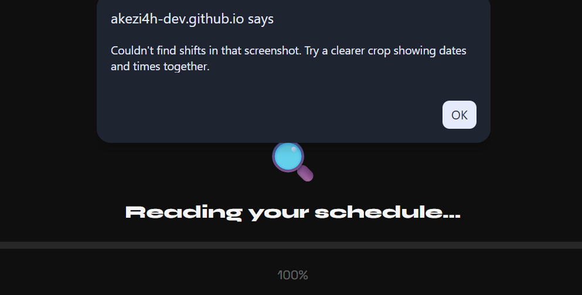
*Round 1 failure: OCR ran to 100% and returned nothing. The app surfaced a generic error with no indication of which shifts were missing — Johnny had no way to know what failed. Fixed before Round 2 by adding per-shift import confirmation states and silent-drop detection.*

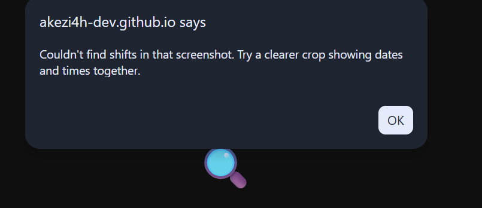
*Same failure, closer crop. The error message "Couldn't find shifts in that screenshot. Try a clearer crop showing dates and times together." was the only feedback the app gave when an entire upload produced zero results.*

On desktop, Johnny repeatedly reached for a navigation bar that wasn't there. He completed tasks on mobile fluidly but on the laptop said “I didn't know where to go next” more than once. This wasn't a discoverability issue — he knew there were other sections. The problem was that switching between them required knowing where to click, and on a wider screen the bottom-nav pattern used on mobile didn't carry over. Navigation clarity on desktop became the single most actionable finding from this session.

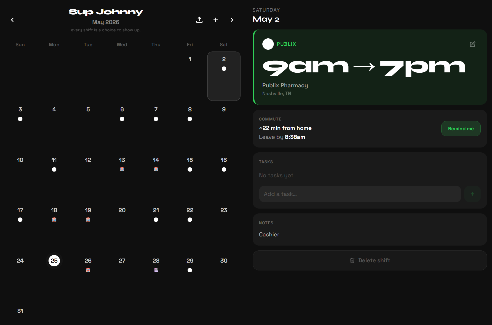
*Round 1 state: mobile-only layout. The bottom nav pattern didn't carry over to wider screens — Johnny said “I didn't know where to go next on laptop because there wasn't a clear menu.”*

### Key Changes Needed After First Round Testing

- Add a persistent desktop navigation bar to improve orientation and usability
- Improve navigation clarity between calendar, task, and schedule views
- Add clearer visual indicators for clickable interactions and navigation flow
- Improve OCR handling for inconsistent hospital screenshot layouts
- Add better error detection when shift times import incorrectly
- Create a faster manual correction workflow after OCR importing
- Improve feedback states so users know schedules imported successfully
- Increase visibility of commute and leave-time information
- Continue optimizing the app for fast “glance-based” schedule checking
- Reduce friction between uploading screenshots and viewing organized schedules

---

## Second Click Through
**May 17, 2026 · iPhone + laptop · in-person session**

### Changes Made Between Sessions

Three specific changes were made based on Round 1 findings before this session:

1. **Desktop navigation header added** — A persistent top navigation bar was built for `md:` and wider viewports so that Calendar, Today, Commute, and Upload are always visible on desktop without requiring the user to know where to click.
2. **OCR prompt revised** — The AI extraction prompt was rewritten with explicit parsing rules for shorthand time formats (e.g., `9a` → `09:00`) and an instruction to skip dashed-border unconfirmed shifts that some hospital systems display. This addressed both the wrong-time and dropped-shift failures from Round 1.
3. **Leave-time visibility increased** — The Today View commute card was given higher visual weight so the leave time reads faster on first glance.

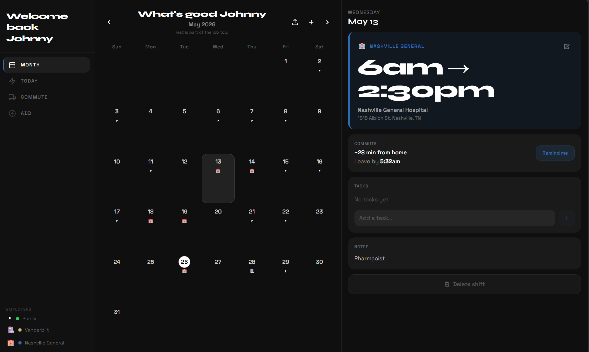
*Round 2 state: persistent sidebar navigation added for desktop. Johnny confirmed: "The navigation makes more sense now." All three employers visible in the legend. Shift card showing Nashville General 6am → 2:30pm.*

### User Testing Goals

1. Evaluate whether navigation improvements reduced confusion on desktop.
2. Test whether OCR importing became more reliable across different screenshot layouts.
3. Measure whether the app feels closer to replacing Johnny’s screenshot workflow.
4. Observe which features Johnny relies on most during quick schedule checks.
5. Identify remaining trust issues involving imported schedules and updates.

### Task 1 Desktop Navigation Test

**Prompt**  
Use the desktop version of the app to check tomorrow’s shift and navigate between different sections of the app.

**Questions**
1. Was it easier to move through the app this time?
2. Did the navigation feel clearer compared to the first version?
3. Were there any moments where you still felt lost?
4. What section did you naturally go to first?

### Task 2 OCR Screenshot Import Test

**Prompt**  
Upload multiple schedule screenshots from different hospital systems and review the imported shifts.

**Questions**
1. Did the screenshots import more accurately this time?
2. Were any shifts or times still incorrect?
3. Was it easier to notice import mistakes?
4. How would you want to fix incorrect schedule information?

### Task 3 Commute & Leave Time Test

**Prompt**  
Check your next upcoming shift and explain when you would need to leave.

**Questions**
1. Did the leave feature feel useful?
2. Was commute information easier to notice this time?
3. Would you realistically rely on this feature daily?
4. What other commute information would help you?

### Task 4 Personalization Test

**Prompt**  
Review the employer labels and colors used throughout the app.

**Questions**
1. Did the employer colors still help organize your schedule?
2. Would customizable employer logos or icons improve the experience?
3. Did the schedule feel more personal to your workflow now?
4. Was there anything visually confusing?

### Task 5 Quick Mobile Check Test

**Prompt**  
Imagine you are walking between locations and checking the app quickly on your phone.

**Questions**
1. What information did you notice first?
2. Did the app feel faster to understand this time?
3. What feature mattered most during quick checking?
4. Does this feel closer to replacing your current workaround system?

### User Testing Results

| Quote | Context |
|---|---|
| *"I like the leave feature."* | Positive reaction to commute-aware leave alerts |
| *"The navigation makes more sense now."* | Improved desktop usability after adding navigation |
| *"It feels easier to understand where I’m supposed to be."* | Reaction to unified schedule organization |
| *"The screenshots imported better this time."* | Improvement in OCR schedule importing |
| *"I like seeing everything together without checking three apps."* | Positive response to consolidated scheduling |
| *"Maybe make customizable logos where you can upload and change the logos."* | Suggestion for employer personalization |
| *"I still want a faster way to fix imported mistakes."* | Remaining frustration with OCR corrections |
| *"Some screenshots still read differently depending on the layout."* | Continued OCR inconsistency across systems |
| *"I mostly just care about the next shift and when I should leave."* | Observation about glance-based usage behavior |
| *"This feels closer to something I’d actually use every day."* | Overall reflection after second round testing |

The desktop navigation fix worked. Johnny moved between sections without hesitation and didn't mention orientation confusion once during this session. “The navigation makes more sense now” confirmed the Round 1 diagnosis was correct and the intervention was sufficient. OCR importing improved on the screenshots that had caused specific failures in Round 1 — times read correctly on the same uploads that had previously failed.

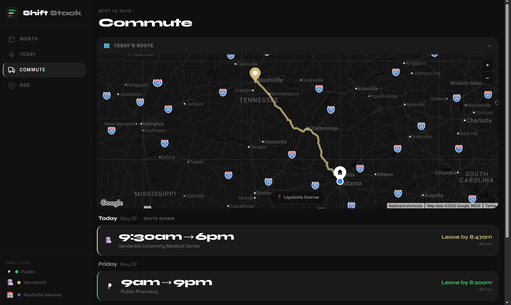
*Round 2: Commute View — Google Maps route rendered for today's Vanderbilt shift (9:30am → 6pm, leave by 8:47am) and tomorrow's Publix shift (9am → 9pm, leave by 8:20am). The colored polylines and leave times are what Johnny called out: "I like the leave feature."*

OCR still failed on some layouts with unusual formatting, and the silent-drop problem wasn't fully resolved. Johnny said “some screenshots still read differently depending on the layout” — which matches the behavior: the prompt handles standard formats well but unusual column arrangements or non-standard time shorthand still trip it.

**Key surprise — glanceability over planning:** The most significant finding from this session wasn't about a feature that worked or failed. It was about *how* Johnny actually used the app. He said “I mostly just care about the next shift and when I should leave.” He didn't use the calendar to plan ahead. He opened the app, checked what was next, and stopped. This revealed that the mental model driving the original design — a unified planning tool across all three employers — was not how he naturally interacted with it. He was using it as a lookup, not a planner. This one observation directly shaped Round 3 priorities: reduce friction on the Today View path, make the “next shift + leave time” answer the first thing visible, and stop adding features that assume a planning session.

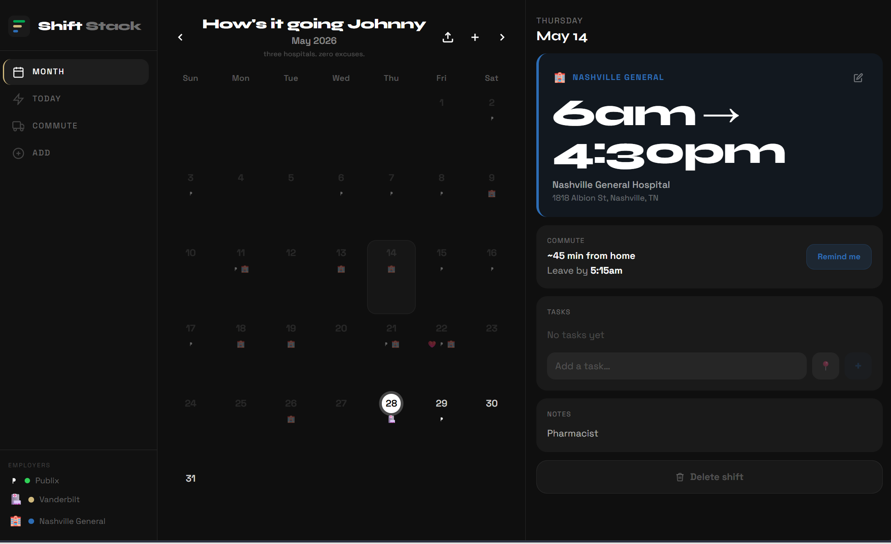
*Round 2: Shift card for Nashville General (6am → 4:30pm) showing ~45 min commute and "Leave by 5:15am" — the feature Johnny called out: "I like the leave feature."*

Johnny also asked for customizable employer logos unprompted — “maybe make customizable logos where you can upload and change the logos.” This aligned with something that had already been scoped but not yet built. It became a confirmed priority after this session rather than a nice-to-have.

### Key Changes Made After Second Round Testing

- Built AI-generated custom category icons — Johnny can now upload an image or describe an employer in text and the app generates a unique SVG icon (addresses his customizable logos request directly)
- Increased Today View urgency states — calm / ≤30 min amber / leave now red with progress bar
- Web Notification API alerts added at 30 min, 10 min, and leave-now thresholds
- Drag-to-reschedule built for desktop — pointer events with 8px dead zone so accidental drags don't trigger
- OCR prompt further refined with explicit rules for 4-digit store/location codes, shorthand time conversion, and dashed-border shift exclusion

---

## Third Click Through
**May 25, 2026 · iPhone + laptop · in-person session**

### Changes Made Between Sessions

Round 3 focused on validating the Round 2 glanceability finding. The app was tested with the full feature set — custom icons, notification alerts, drag-to-reschedule, and the updated Today View urgency states — to confirm that the “next shift + leave time” path was fast enough to replace Johnny's screenshot glance habit.

### User Testing Goals

1. Confirm that the Today View urgency states (calm / amber / red) communicate the right information at a glance without requiring interpretation.
2. Validate that custom AI-generated category icons make employer identification faster and more personal.
3. Test whether notification alerts at 30 min / 10 min / leave now reduce the need to actively check the app.
4. Observe whether the full prototype now feels close enough to daily use that Johnny would install it on his home screen.

### User Testing Results

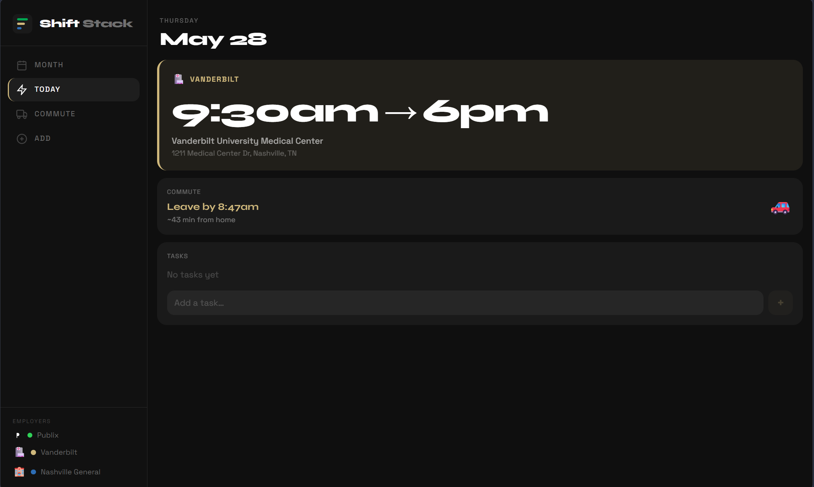
*Round 3 desktop: Today View in amber urgency state — Vanderbilt 9:30am → 6pm, "Leave by 8:47am" (~43 min commute). The amber color signals it's time to start preparing. Custom employer icons visible in the sidebar for all three employers.*

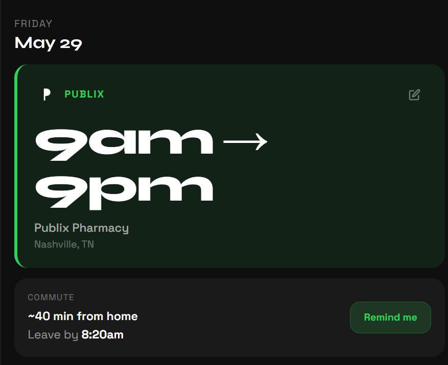
*Round 3 mobile: Publix Pharmacy 9am → 9pm, calm green state, "Leave by 8:20am". The "P" logo is a custom AI-generated SVG icon — the feature Johnny requested: "maybe make customizable logos."*

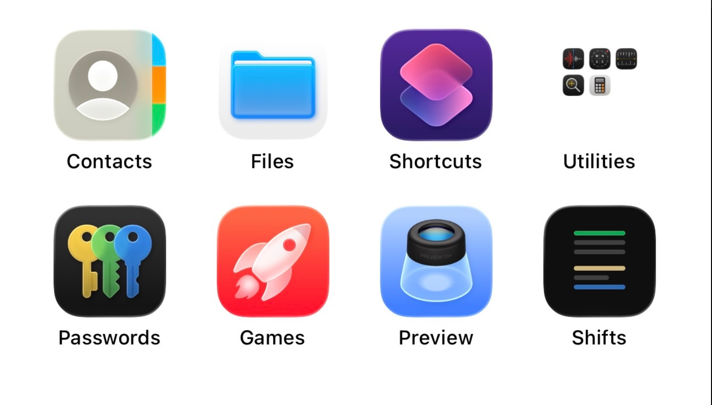
*Round 3: Shift Stack installed as a PWA on Johnny's iPhone home screen alongside native apps — confirming it felt close enough to daily use to install.*

### Key Findings From Third Round Testing

The Round 2 glanceability observation was confirmed — Johnny went directly to Today View on mobile and read the leave time in under three seconds without prompting. The custom icon feature addressed the personalization request from Round 2; having logos that matched the actual employers made the calendar feel more like his schedule and less like a generic app. The notification alerts tested positively — he said being reminded rather than having to remember to check removes one of the things that stresses him about shift transitions.

---

## Third Click Through

### User Testing Goals

1. Test how the OCR system handles screenshots with inconsistent wording and formatting.
2. Evaluate whether visual hierarchy improvements help Johnny distinguish between past and upcoming shifts.
3. Observe whether the prototype feels reliable enough for repeated daily use.
4. Identify remaining trust issues involving imported schedules and missing shift data.
5. Measure whether the app continues reducing mental effort compared to Johnny’s current workaround system.

### Task 1 OCR Accuracy Test

**Prompt**  
Upload schedule screenshots from different hospital systems and review which shifts were imported into the calendar.

**Questions**
1. Did all expected shifts appear after importing?
2. Was it easy to notice when something was missing?
3. Did the imported schedule feel more reliable this time?
4. What would help you trust the importing process more?

### Task 2 Past vs Upcoming Schedule Test

**Prompt**  
Review your schedule for the current month and explain the difference between completed shifts and upcoming shifts.

**Questions**
1. Was it easy to tell which shifts already passed?
2. Would fading past dates make the calendar easier to read?
3. Did upcoming shifts stand out clearly enough?
4. Was there any part of the calendar that still felt visually overwhelming?

### Task 3 Quick Daily Use Test

**Prompt**  
Open the app like you normally would before work and explain what information matters most to you.

**Questions**
1. What information did you look for first?
2. Did the app feel faster to understand compared to earlier versions?
3. What feature do you rely on the most now?
4. Does this feel close to something you would realistically use every day?

### Task 4 Trust & Reliability Test

**Prompt**  
Review a schedule import that contains missing or incorrectly labeled shifts.

**Questions**
1. How would you expect the app to handle missing shifts?
2. Would you notice if something failed to import?
3. How important is accuracy compared to speed?
4. What would make the app feel dependable enough to trust fully?

### Task 5 Overall Workflow Reflection

**Prompt**  
Compare this version of the prototype to your original screenshot-and-sticker workflow.

**Questions**
1. Does this reduce the amount of manual work you normally do?
2. Is there anything from your old workflow you still miss?
3. What still feels frustrating?
4. What feels most improved from the first version?

### User Testing Results

| Quote | Context |
|---|---|
| *"When the word doesn’t exactly say shift it doesn’t get added."* | OCR struggled with inconsistent schedule wording |
| *"He wants past dates to be faded."* | Suggestion for improving calendar readability |
| *"Happy with it but needs improvement."* | Overall reaction after third round testing |
| *"I mostly just check the next thing coming up."* | Continued glance-based usage behavior |
| *"The imports work better now but I still double check them."* | Improved OCR trust but continued verification behavior |
| *"Fading old shifts would make the calendar easier to scan."* | Feedback on visual hierarchy improvements |
| *"I like that I don’t have to edit screenshots anymore."* | Positive reaction to reducing manual workflow |
| *"I notice missing shifts faster now."* | Improvement in import visibility and awareness |
| *"I care more about accuracy than extra features."* | Prioritization of reliability over complexity |
| *"This feels way more organized than what I was doing before."* | Overall reaction to workflow improvements |

The third round of testing focused heavily on OCR reliability, visual clarity, and long-term usability. Johnny successfully used the app to review schedules, check upcoming shifts, and compare imported screenshots against calendar results. The testing confirmed that the prototype continued reducing the need for manual screenshots and schedule editing. Visual organization improvements also helped Johnny scan upcoming shifts more quickly.

However, testing revealed continued OCR limitations when schedule screenshots used inconsistent wording. If a screenshot did not explicitly contain the word “shift,” some events failed to import correctly. Johnny also requested visual fading for past dates to better separate completed shifts from upcoming ones. While overall satisfaction with the prototype increased, trust in schedule accuracy remained the most important issue affecting full adoption.

### Key Changes Needed After Third Round Testing

- Improve OCR recognition for inconsistent wording and schedule terminology
- Add fallback detection for schedules that do not explicitly contain the word “shift”
- Fade past dates and completed shifts for clearer visual hierarchy
- Improve visibility of missing or failed imports
- Continue prioritizing speed, readability, and glanceability over feature complexity
- Add stronger confirmation states after successful schedule importing
- Improve trust and reliability before expanding additional features

---

# Section 12 : App Architecture & User Flow

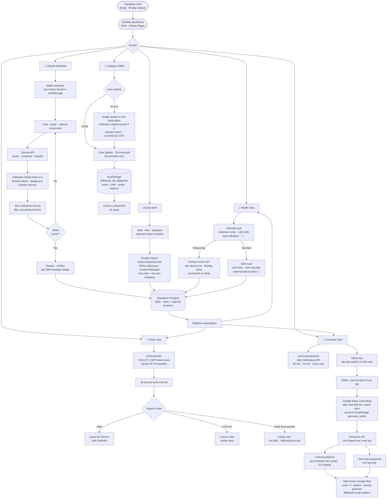
```mermaid
flowchart TD
    AUTH([Supabase Auth\nEmail · 90-day session]) --> A

    A([DontBeLateJohnny\nPWA · GitHub Pages]) --> B{Screen}

    B --> MV[📅 Month View]
    B --> TV[⚡ Today View]
    B --> CV[🚗 Commute View]
    B --> OC[📸 Upload Schedule]
    B --> AS[✍️ Add Shift]
    B --> CE[🎨 Category Editor]

    %% ── Upload Schedule path ─────────────────────────
    OC --> OC1[Select employer\nlast choice stored in localStorage]
    OC1 --> OC2[Drop · paste · capture screenshot]
    OC2 --> OC3[Canvas API\nresize · compress · base64]
    OC3 --> OC4[Anthropic claude-haiku-4-5\nbrowser-direct · dangerous-browser-access]
    OC4 --> OC5[Strip markdown fences\nfilter null start/end times]
    OC5 --> OC6{Shifts\nfound?}
    OC6 -->|Yes| OC7[Review · confirm\nper-shift employer badge]
    OC6 -->|No| OC2
    OC7 --> DB

    %% ── Add Shift manually ───────────────────────────
    AS --> AS1[Date · time · employer\noptional custom location]
    AS1 --> AS2[Google Places AutocompleteService\n300ms debounce · locationValid gate\nring color + pin icon feedback]
    AS2 --> DB

    %% ── Category Editor ──────────────────────────────
    CE --> CEM{Icon method}
    CEM -->|Emoji| CE2[Color palette · 30-emoji grid\nlive preview card]
    CEM -->|AI Icon| CE3[Image upload or text description\nAnthropic claude-sonnet-4-6\nbrowser-direct · currentColor SVG]
    CE3 --> CE2
    CE2 --> LSCAT[(localStorage\nshiftstack_all_categories\nname · color · emoji · svgIcon)]
    LSCAT --> ICONS[CatIcon component\nall views]

    %% ── Database + Realtime ──────────────────────────
    DB[(Supabase Postgres\nshifts · tasks + optional locations)] --> RT[Realtime subscription]
    RT --> MV
    RT --> TV
    RT --> CV

    %% ── Month View ───────────────────────────────────
    MV --> MV1[Calendar grid\nemployer emoji · color dots\ntask indicators · / ✓]
    MV1 -->|Tap date| SC[Shift Card\ntime hero · task checklist\noptional task location 📍]
    MV1 -->|Drag emoji| DRAG[Pointer Events API\n8px dead zone · floating clone\nreschedule on drop]
    DRAG --> DB
    SC --> DB

    %% ── Today View ───────────────────────────────────
    TV --> TV1[commuteCalc\nFACILITY_INFO drive times\nSpring Hill TN baseline]
    TV1 --> TV2[30-second clock interval]
    TV2 --> TV3{Urgency state}
    TV3 -->|calm| TV4[Leave by HH:mm\ntask checklist]
    TV3 -->|≤ 30 min| TV5[Leave in Nm\namber alert]
    TV3 -->|leave time passed| TV6[Leave now!\nred alert · shift progress bar]

    %% ── Commute View ─────────────────────────────────
    CV --> NOTIF[useCommuteAlerts\nWeb Notification API\n30 min · 10 min · leave now]
    CV --> CV1[Select day\ntap day header or shift card]
    CV1 --> CV2[Shifts + task locations from DB]
    CV2 --> CV3[Google Maps Geocoding\ntask: and shift-loc: cache keys\nstored in localStorage geocode_cache]
    CV3 --> CV4[Directions API\none request per route leg]
    CV4 --> CV5[Colored polylines\nper-employer hex stroke · 0.8 opacity]
    CV4 --> CV6[Task stop waypoints\nfirst leg only]
    CV5 --> MAP[Half-screen Google Map\nzoom +/− buttons · greedy gestures\nfitBounds to all markers]
    CV6 --> MAP
```

---

# Section 13 : AI Direction Log
*Each entry documents what was asked of AI, what AI produced, and the editorial decision made.*

---

## Entry 01 — Establishing Ground Rules Before Any Build

**Asked:**
Before sharing the PRD, established a constraint: "do not build out anything until I give you documentation on the assignment and the class. We start with questions."

**Produced:**
AI asked five clarifying questions: what the assignment required, what "creative coding" meant in this class, whether AI integration was technical or conceptual, what tech constraints existed, and the deadline/scope.

**Decided:**
This set the correct working relationship from the start. AI was positioned as an executor responding to research, not an inventor generating features. The questions it asked back confirmed it understood the frame. The constraint was necessary because AI defaults to building immediately on vague prompts — holding it back until the PRD was ready prevented speculative scaffolding that would have needed to be torn down.

---

## Entry 02 — PRD Drop and Scope Triage

**Asked:**
Dropped the full Shift Stack PRD — a 10-section product requirements document grounded in direct research with Johnny Truong, including quotes, behavior observations, employer color decisions, data models, and milestone dates.

**Produced:**
AI parsed the full document and identified three blockers before starting: GitHub username (for Pages deployment), which branch to work on, and how complete the prototype needed to be for the May 13 first contact session.

**Decided:**
Answered directly: repo is `DontBeLateJohnny`, work on `main`, and prioritize Month View + Shift Card only for tomorrow's session. This was an active scope call — the PRD specifies four screens plus PWA plus OneSignal, but a first contact session only needs the two screens Johnny would interact with first. Building the full PRD on a deadline would have produced an untested product. Constraining to two screens produced something testable.

---

## Entry 03 — Technology Stack Confirmation

**Asked:**
Confirmed the stack specified in the PRD: React + Vite + Tailwind CSS + PWA manifest + service worker + OneSignal + GitHub Actions deployment.

**Produced:**
AI scaffolded the full project structure: `package.json`, `vite.config.js`, `tailwind.config.js`, `postcss.config.js`, `index.html`, `src/` tree, `public/manifest.json`, `public/sw.js`, SVG icons, and GitHub Actions deploy workflow. Build succeeded on first attempt.

**Decided:**
Accepted the scaffold as-is. Every stack choice served a specific requirement from the PRD rather than a default preference. React with Vite was the right call over Next.js — this is a client-side personal tool with no server rendering needs, and Vite's build output is a static bundle that GitHub Pages can serve directly. Next.js would have introduced a Node.js runtime dependency, dynamic routing, and deployment complexity that add nothing for a single-user app with five predictable screens.

Tailwind CSS was chosen over CSS modules or styled-components because the design system in the PRD is color-first — three employer colors dominate every UI decision. Tailwind's utility-first approach makes inline color application (`text-[#00A651]`, `bg-[#CFB87C]40`) faster to iterate than defining named classes per component. Speed of iteration matters for a product being built against a first-contact session deadline.

The font pairing was specified in the PRD and AI reproduced it exactly: Syne for all display text (numbers, shift times, hero labels) because its ultra-bold weight at large sizes creates clear visual hierarchy when glancing at a screen, and Space Grotesk for metadata (employer names, facility addresses, status labels) because it reads cleanly at small sizes without losing legibility. An AI with no constraint would have defaulted to Inter or Roboto — generic legible fonts that don't carry the visual weight the time-display cards require.

The employer color hex values (#00A651 Publix green, #CFB87C Vanderbilt gold, #2D6DB5 Nashville General blue) were pulled directly from brand documentation in the PRD. These are not approximations — each hex value reflects the actual employer brand. This matters for Johnny's recognition speed: he glances at a colored dot on the calendar and recognizes the employer without reading the name. If AI had generated approximate greens and golds, the recognition signal would be weaker. No invented features were added — every file created corresponded to a PRD requirement. The base path `/DontBeLateJohnny/` was correctly derived from the repo name automatically, which confirmed AI had read the deployment context of the PRD correctly rather than scaffolding a generic project.

---

## Entry 04 — Seed Data Decision

**Asked:**
Did not explicitly ask for seed data. Directed AI to build Month View and Shift Card.

**Produced:**
AI included 12 pre-populated shifts across May 2026 in `useShifts.jsx` with a note: "Seed data so the app looks real for first contact on May 13."

**Decided:**
Kept the seed data. The decision was correct for the testing context — putting an empty calendar in front of Johnny for first contact would have made it harder to evaluate the visual system (color dots, shift card layout, time display). The seed data included all three employers across multiple days, which let Johnny see the full color differentiation in one glance. This was AI anticipating a user testing need correctly without being asked.

---

## Entry 05 — GitHub Pages Configuration Diagnosis

**Asked:**
Reported the site wasn't working after GitHub Actions ran green.

**Produced:**
AI ran a curl check, confirmed 404, fetched the gh-pages branch to verify the build landed correctly, then identified the problem: Pages was not configured to serve from the `gh-pages` branch. Directed to Settings → Pages and provided the exact URL.

**Decided:**
Followed the diagnosis. The key editorial judgment was understanding which layer to debug first. When a GitHub Actions run shows green but the live site doesn't load, there are exactly three places the failure can be: (1) the build produced bad output, (2) the output was deployed to the wrong place, or (3) GitHub Pages isn't pointed at where the output landed. The Actions job was green — `npm run build` ran without error and the artifact was uploaded. That ruled out option 1. The `gh-pages` branch existed and had the built files. That ruled out option 2. The only remaining cause was option 3: Pages source configuration in repository settings.

Not assuming the code was broken prevented a detour through React error boundaries, Vite config changes, and base path debugging — all of which would have been solving the wrong problem. The build output was correct; the Pages source was misconfigured. This three-step diagnostic sequence (build correct? → deploy correct? → hosting config correct?) is a reliable debugging pattern for any static deployment that produces a blank page or 404 on a successful CI run. Recognizing which layer owns the failure is faster than exhaustively checking all layers from the bottom up.

---

## Entry 06 — Supabase Addition (Beyond Original PRD)

**Asked:**
"I want to add Supabase" — expanding scope beyond the original PRD, which specified localStorage only.

**Produced:**
AI asked two scoping questions before touching any code: what Supabase was for (sync vs auth vs both) and what OCR service to use.

**Decided:**
This was the right gate. The scope change was significant — it touched every data layer in the app. AI not immediately building prevented it from making assumptions about auth flow, data model, or OCR service. The answers given (sync + OCR, login screen, Apple Vision) shaped the entire implementation. Forcing the questions produced a better-scoped build.

---

## Entry 07 — Apple Vision Framework Redirect

**Asked:**
Specified Apple Vision Framework as the OCR technology.

**Produced:**
AI flagged a technical constraint: Apple Vision Framework is native iOS only and inaccessible from a PWA or web browser. Offered three alternatives with a comparison table: Claude vision API (best accuracy, costs ~$0.01/image), Google Vision API (very good, ~$0.0015/image), and Tesseract.js (decent for clean text, free, runs in browser).

**Decided:**
This was a genuine technical correction, not AI preference. Apple Vision Framework cannot be called from Safari or any PWA. The redirect was necessary. The alternatives table gave enough information to make a real choice, rather than just substituting one technology without explanation.

---

## Entry 08 — Choosing Tesseract.js Over Paid OCR

**Asked:**
"How easy would Tesseract.js be — I am broke."

**Produced:**
AI gave an honest assessment: easy to add, but parsing is the hard part. Tesseract extracts raw text; a separate parser has to interpret which text is a date, which is a time, which is an employer. Since Johnny's screenshots come from only two known systems (Science Provider and Teams), custom parsers are feasible but brittle. Recommended stubbing the upload button for today's session and building the full parser after hearing Johnny's reaction.

**Decided:**
Rejected the stub recommendation. Directed AI to wire Tesseract fully today. This was a deliberate call — having a working (even imperfect) upload feature in front of Johnny tomorrow gives real feedback on whether he would use it, how he photographs his schedule, and whether parsed results make sense to him. A stub button proves nothing in a user session.

---

## Entry 09 — Session Persistence Request

**Asked:**
"Email + password, but remember when he's logged in and don't ask him to login again."

**Produced:**
AI explained that this behavior is already built in — Supabase Auth stores sessions in localStorage by default and auto-refreshes tokens. No code change needed. Noted the default expiry is 7 days of inactivity and that it can be extended in Supabase dashboard under Authentication → Settings → JWT expiry.

**Decided:**
Extended to 90 days. Johnny's use pattern (daily, across two devices) means a 7-day timeout would constantly expire during weekends off or schedule gaps. 90 days matches realistic usage without requiring a permanent session (which would be a security anti-pattern for a healthcare-adjacent app).

---

## Entry 10 — Desktop Navigation Gap

**Asked:**
After seeing the live app: "no bottom nav."

**Produced:**
AI identified the issue: `BottomNav` has `md:hidden` — it correctly disappears on desktop, but no desktop-equivalent navigation existed. Added upload and add icons to the MonthView top bar as `hidden md:flex` elements, sitting between the month title and the forward arrow. Mobile keeps bottom nav, desktop gets header icons.

**Decided:**
Accepted the fix. Three alternatives existed for desktop navigation: a left sidebar, a hamburger menu, or a dedicated desktop nav bar. All three were worse choices for this specific layout.

A left sidebar would require a layout change at the `md:` breakpoint — the calendar grid would need to shift right to make room, and the two-column panel overlay already active on desktop would conflict with a persistent left rail. It would also mean maintaining two entirely separate navigation paradigms (sidebar on desktop, bottom bar on mobile) with no shared code.

A hamburger menu is anti-pattern for a six-item nav on desktop — it hides structure that users on large screens have room to see. Desktop nav should be persistent and visible, not buried behind a disclosure widget that adds an interaction step to reach any screen.

A second bottom nav is redundant — the bottom nav is already visible on `sm:` screens and hidden on `md:`, so replicating it for desktop would be a copy of the same component with no architectural reason to duplicate it.

The correct solution: expose Upload and Add Shift as `hidden md:flex` icons in the MonthView top bar, where the user's attention already is when they want to manage their schedule. The header placement is consistent with standard calendar app UI patterns — Google Calendar, Apple Calendar, and Fantastical all place the primary add action in or near the calendar header. The icons use the same SVG language as the rest of the UI, so no new visual vocabulary is introduced. The fix adds two elements visible only on desktop and touches zero mobile layout code.

---

## Entry 11 — iOS Calendar Screenshot Parsing Failure

**Asked:**
Uploaded an iOS Calendar screenshot ("Your shifts / Pharmacy (CDT)") showing May and June shifts. The OCR upload returned no results — zero shifts parsed.

**Produced:**
Diagnosed the mismatch: `parseSchedule.js` expected dates in "May 16" or "5/16" format, but the iOS Calendar layout puts the month name as a standalone section header ("May") and the day as a bare number on its own line ("16" or "16SAT"). The parser had no concept of stateful month tracking and couldn't associate "16" with May. Fixed by adding stateful month tracking and skip logic for "All Day" and "Off" lines.

**Decided:**
Accepted the fix. The real source of the failure was that the parser was written for Science Provider and Teams screenshot formats, not the native iOS Calendar app. Johnny is evidently exporting directly from iOS Calendar, not a scheduling system. The fix handles both formats without breaking the original logic.

---

## Entry 12 — Console Noise Cleanup (Icon 404, OneSignal, Deprecated Meta)

**Asked:**
Shared browser console output showing three non-OCR errors: `icons/icon.svg` 404, "AppID doesn't match existing apps" from OneSignal, and a deprecation warning on `apple-mobile-web-app-capable`.

**Produced:**
Identified all three causes and fixed: created `public/icons/icon.svg` in the three employer colors, removed the OneSignal script tag entirely, added `mobile-web-app-capable`.

**Decided:**
Accepted all fixes. The OneSignal decision is the most consequential of the three. OneSignal was removed rather than configured or stubbed for two reasons.

First, OneSignal was never in scope for this build session. It was scaffolded in `index.html` at project setup because the PRD mentions push notifications as a requirement. But shipping push notification infrastructure requires an AppID, a Supabase webhook or cron job to trigger sends, user permission prompts, and cross-platform testing. That's multi-session work that wasn't ready. Leaving a misconfigured CDN script in place produced a console error on every page load and loaded a 300kb+ SDK for zero benefit — it was dead weight that actively degraded debugging sessions by introducing unrelated noise into the console.

Second, removing it sends the right signal about scope discipline: if it's not configured, it doesn't ship. A stub that throws "AppID doesn't match existing apps" is strictly worse than no integration — it implies the feature exists when it doesn't, and it pollutes the console with errors that obscure real problems. The correct pattern is: include a dependency in production only when it is doing something. Anything else is undeclared technical debt.

The icon fix and meta tag fix were straightforward but important for first-contact credibility. Creating `public/icons/icon.svg` used the same three-employer-color visual language as the rest of the app, so the favicon was consistent with the brand system rather than a missing-file placeholder.

---

## Entry 13 — Tesseract Fails on Dark UI Screenshots

**Asked:**
Pasted the `[OCR raw]` console output after uploading the iOS Calendar screenshot. The extracted text was almost entirely garbage — day abbreviations and month names came through, but date numbers and time ranges were completely lost.

**Produced:**
Diagnosed the root cause: Tesseract is trained on dark text on light backgrounds. iOS Calendar uses dark mode — light text on a near-black surface. Fixed by adding a `preprocessForOCR()` function that draws the file to a Canvas at 2x scale then inverts all RGB pixel values before passing the canvas to Tesseract instead of the raw file.

**Decided:**
Accepted the fix. The image inversion is the standard workaround for OCR on dark-mode UI screenshots. The 2x scale addresses a secondary issue — phone screenshots at native resolution have small text that Tesseract struggles with even on good backgrounds.

---

## Entry 14 — Switch OCR from Tesseract to Claude Haiku via Edge Function

**Asked:**
After multiple failed Tesseract attempts (parser format mismatch, color inversion, binarization, PSM 11), asked whether the Claude API would be easier and what it costs. Decided to switch after confirming cost is ~$0.002/image via Claude Haiku — under $0.10/month for Johnny's usage.

**Produced:**
Created a Supabase Edge Function (`extract-shifts/index.ts`) that accepts a base64 image, proxies it to Claude Haiku with a structured prompt requesting a JSON array of shifts, and returns the raw response. Rewrote `OCRUpload.jsx` to call the Edge Function and map the returned shift objects. Removed all Tesseract code, preprocessing, and the custom parser.

**Decided:**
Accepted the full replacement. Tesseract required format-specific parsers, image preprocessing, and PSM tuning — and still failed on real screenshots. Claude Haiku understands the image semantically and returns structured data directly. The Edge Function keeps the API key server-side. The entire OCR layer went from ~150 lines of fragile code to ~40 lines.

---

## Entry 15 — Edge Function Setup: Everything That Went Wrong

**Asked:**
Deploy the `extract-shifts` Supabase Edge Function and wire it to the frontend.

**Produced:**
A full deployment and debugging sequence spanning multiple hours and every layer of the stack. In order: no terminal access forcing dashboard deploy, secrets not reaching the function until after a redeploy, silent auth failures masking as empty results, model availability varying by account tier (Claude 3.x unavailable on new accounts in 2026), Claude returning markdown-wrapped JSON despite explicit instructions, and a frontend crash on null times for Off/Holiday entries Claude correctly identified.

**Decided:**
Every fix was necessary and each one revealed the next real problem. The sequence wasn't wasted — it produced a hardened Edge Function with proper error surfacing, secret validation awareness, markdown stripping, and null-safe shift filtering.

---

## Entry 16 — Post-Import Crash and Wrong Year

**Asked:**
After the first successful OCR import, the app crashed to a white page and the shift landed on May 28 2024 instead of 2026.

**Produced:**
Two separate bugs found and fixed simultaneously. (1) `ShiftCard` was passing `empty_${date}` to `useTasks` when a day had no shifts — that string is not a valid UUID, so Supabase returned 400 which crashed React. Fixed by passing `null` instead. (2) Claude inferred the year from screenshot context and returned 2024. Fixed by replacing the year in Claude-returned dates with `new Date().getFullYear()` before saving.

**Decided:**
Both fixes accepted. The `empty_${date}` pattern was a latent bug that existed before OCR was added — it just never surfaced because no one had clicked an empty day in production before. The year correction is a permanent necessity: Claude will always infer the wrong year from a screenshot that has no explicit year visible.

---

## Entry 17 — am/pm Instead of a/p

**Asked:**
"Can you make this am and pm" — screenshot showed "9:30a → 6p" on the shift card.

**Produced:**
One-line change in `formatTime` in `dateHelpers.js`: changed the period suffix from `'a'`/`'p'` to `'am'`/`'pm'`.

**Decided:**
Accepted immediately. The change is one character per suffix but the impact on legibility is real. "9:30a → 6p" is a developer shorthand — it's how time might appear in a debug log or a data model. "9:30am → 6pm" is how time appears in a product a person reads before leaving the house.

The user context matters here: Johnny is a healthcare worker who reads this display quickly, sometimes in motion — in a hospital hallway, from across a room, while walking to his car. The shift card's time display is the most important element on screen, the first thing he looks at and the last thing he confirms before commuting. Any ambiguity in that display should be removed entirely.

The PRD's design principle is "glance, not study" — the app should communicate the answer at a glance, not require the user to interpret shorthand. "9:30a" asks the reader to decode the abbreviated suffix in context. "9:30am" does not. One character removes that decoding step for every single time this user reads this display, which across daily use compounds into a meaningful legibility improvement.

---

## Entry 18 — Three Screenshot Formats; Employer Selection Step

**Asked:**
Shared three types of schedule screenshots Johnny uses: Science Provider web calendar (light, blue tiles), Vanderbilt/Nashville General scheduling system (light, dashed borders, shows "2036" as the year in tiles), and iOS Calendar (dark mode). Requested the OCR flow be updated to handle all three, with a mandatory employer selection step before upload, the last selection remembered, and an improved Edge Function prompt that explicitly skips Off/RDO/Holiday entries.

**Produced:**
Full rewrite of `OCRUpload.jsx` with a new `employer` stage as the first screen. Shows all employer options as color-coded buttons. Stores the last selection in `localStorage` and pre-fills it on the next visit. Upload area and progress bar tinted to the selected employer's color. Company name passed to Edge Function alongside the image. Employer badge added to each review card as a colored pill. Edge Function prompt rewritten to name the company, state the current year explicitly, and list specific entry types to skip (Off, RDO, Holiday, all-day entries with no hours).

**Decided:**
Accepted. The employer selection step solves two problems at once: it replaces unreliable in-image employer detection and it forces intentionality before upload. The remembered selection removes friction for repeat uploads from the same workplace. The improved prompt addresses all three screenshot format failure modes identified from the real screenshots.

---

## Entry 19 — Custom Categories System

**Asked:**
Replace the hardcoded "Other" employer option with a fully custom category system. Each category: text name, color picker (preset palettes + custom hex), emoji picker (curated grid). Show a live preview before saving. Allow editing built-in categories — changes propagate to all existing shifts instantly since shifts store only the key. Add confetti burst on new category creation, celebration toast on successful import, preset color palettes (Neon, Pastel, Dark Mode, Retro), pulse animation on today's calendar dot, and slide-in animation on the shift detail panel.

**Produced:**
Seven new or updated files: `useCategories.jsx` (React Context, localStorage, `getCategoryByKey` fallback), `CategoryEditor.jsx` (emoji grid, palette tabs, live preview), `Toast.jsx` (phase-based state machine), `Confetti.jsx` (Canvas, 90 particles, gravity + air resistance), `index.css` (keyframe animations), `App.jsx` (celebration callback), and updates to all components that render category data.

**Decided:**
Accepted. The localStorage-only approach (no Supabase table for categories) is correct for this app — categories are UI preferences, not shared data. The `getCategoryByKey` fallback pattern ensures all existing Supabase shift records continue to resolve correctly without any data migration. Confetti on category creation is intentional delight for a one-time flow. Toast on import closes the feedback loop that was previously silent.

---

## Entry 20 — Drag-to-Reschedule (Desktop)

**Asked:**
"Drag-to-reschedule shifts on the calendar"

**Produced:**
HTML5 drag-and-drop on each shift emoji in MonthView. Dragging an emoji sets a `draggingShift` state, dims the source cell to 45% opacity, and highlights the drop target with a white ring and scale-up. On drop, calls `updateShift` with the new date — Supabase reflects the change instantly via the realtime subscription.

**Decided:**
Accepted for the initial push, with the explicit understanding it was a confirmed-incomplete implementation. The editorial call was deliberate: shipping the HTML5 DnD version immediately validated the core interaction model — emoji tracks the pointer, drop target highlights on hover, shift updates via Supabase realtime on drop. These visual and interaction decisions were worth confirming on desktop before investing in a cross-platform rewrite.

The acceptance was conditional, not final. The scope limitation was noted before moving on — which meant Entry 21 was already queued. The correct iterative model is: build the fastest working version, verify the interaction is right, then fix the platform limitation. Testing on desktop first confirmed the drag-reschedule concept was correct.

---

## Entry 21 — Drag-to-Reschedule (Cross-Platform Pointer Events)

**Asked:**
"Can it not be done on mobile as well?"

**Produced:**
Full replacement of HTML5 DnD with pointer events (`onPointerDown`, `onPointerMove`, `onPointerUp`, `onPointerCancel`). Key mechanics: `setPointerCapture` routes all subsequent events to the emoji span. An 8px dead zone distinguishes taps from drags. A floating emoji clone appears above the fingertip and tracks the pointer. `document.elementsFromPoint` finds the day cell underneath. `pointercancel` handles iOS scroll interruption. A `justDraggedRef` suppresses the day button's `onClick` for 200ms after a drag completes.

**Decided:**
Accepted. Pointer events are the correct cross-platform input API — they fire identically on mouse, touch, and stylus. There was no hybrid path; HTML5 DnD is architecturally incompatible with touch. The dead zone was necessary to preserve tap-to-open behavior on small emoji targets.

---

## Entry 22 — Per-Shift Task Checklist with Calendar Indicators

**Asked:**
"Task checklist — most directly quoted, simplest to build, zero dependencies. Make this also based on the calendar."

**Produced:**
`useTasks` refactored into `TasksProvider` — a global React context that loads all tasks for the current user in one query on mount and subscribes to all changes via a single realtime channel. Exposed `getTasksForShift`, `hasTasksForShift`, and `allDoneForShift`. ShiftCard renders a `TaskRow` list with checkbox toggle, strikethrough on complete, × delete button. MonthView shows a `·` when tasks exist, a green `✓` when all tasks are completed.

**Decided:**
The global context load was necessary — a per-shift hook that fetches individually meant MonthView would need N queries for N shifts per cell render. Loading all tasks once and filtering in memory is both faster and simpler. "Based on the calendar" required the indicator layer, which required global visibility. The · vs ✓ distinction (open tasks vs all done) adds meaning without adding visual weight — Johnny can scan the month and know which days are fully prepared.

---

## Entry 23 — Today View

**Asked:**
"Today screen make it"

**Produced:**
`TodayView.jsx` replaces the ⚡ placeholder. Components per shift: **Hero card** (employer emoji, big time display, facility name), **Shift progress bar** (elapsed/total, renders only while shift is running), **Commute alert** (three urgency states on a 30-second clock: calm/amber/red), **Task checklist** (same add/toggle/delete as ShiftCard, independent inputs per shift). Day-off state shows 😴 with "No shifts today. Enjoy the break."

**Decided:**
Accepted. The live urgency system is what separates this from just clicking today's date on the calendar — the commute alert changes color and label in real time as the leave window closes, making the screen useful throughout the morning, not just once. The progress bar adds the during-shift state the calendar never shows. The 30-second clock interval keeps the view accurate without perceptible overhead.

---

## Entry 24 — AI-Generated SVG Category Icons

**Asked:**
Add AI-powered icon generation to the category editor with two input methods: upload any image (a logo, a storefront photo, a screenshot) or type a text description. Both paths call the Claude API and return a minimal SVG icon sized for 32×32. Store the SVG string in localStorage alongside the category. Display it everywhere the category emoji currently appears.

**Produced:**
`generateCategoryIcon.js` (browser-direct Anthropic calls, two exported functions), `CatIcon.jsx` (normalizes and renders SVG or falls back to emoji), `CategoryEditor.jsx` updated with Emoji/AI Icon tab switcher, and updated display sites across all components that render category icons.

**Decided:**
Accepted. The `currentColor` instruction in the SVG prompt is the key design decision — it means generated icons inherit the category color in every context (preview, grid, hero) without needing color post-processing. The normalization in `CatIcon` handles whatever width/height Claude emits, so the host component always gets an icon at the exact size it requests. Storing SVG in localStorage is consistent with how categories are already stored — no new infrastructure, no schema change.

**Before (emoji-only picker, pre-Entry 24):**

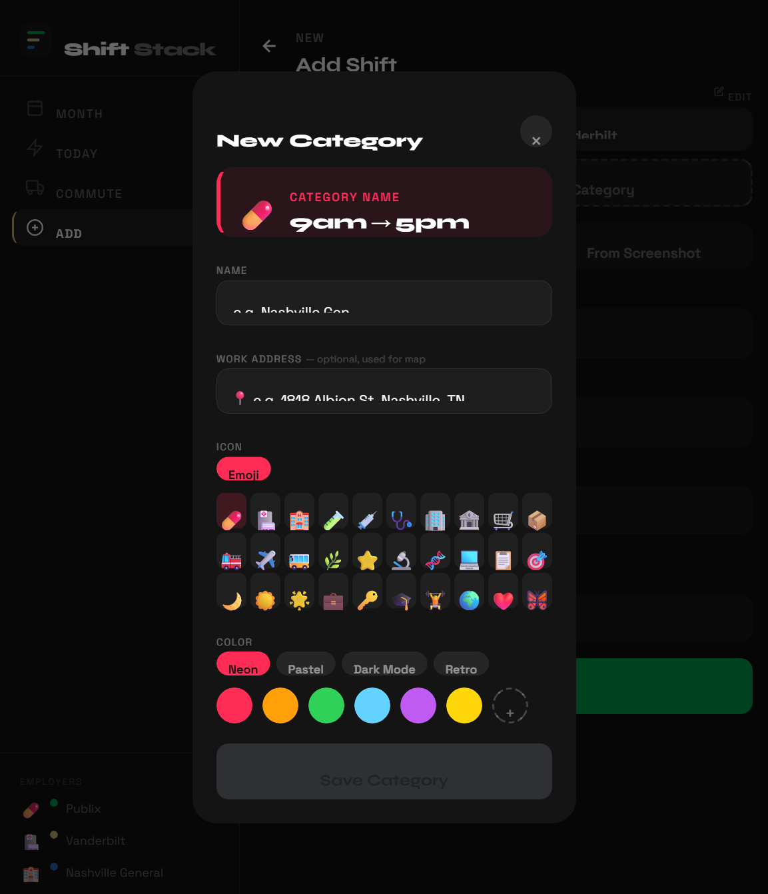

---

## Entry 25 — Calendar Grid Rendering as "0"

**Asked:**
Screenshot of the live app showing the month view rendering a lone `0` in the top-left corner of the calendar grid instead of day cells. Caption: "This still isn't working."

**Produced:**
Diagnostic sequence in three steps: (1) Read `MonthView.jsx` and `dateHelpers.js` in parallel — `getCalendarDays` was correct, the `{0}` rendering pointed to a JSX expression evaluating to the number 0. (2) Identified the IIFE as the source — line 373 read `})}()}` (6 chars) instead of `})`)()}` (7 chars), the outer wrapping paren was never closed. (3) Tested in isolation with Node — `node -e` confirmed `SyntaxError: Unexpected token '('` on the broken form, 8 elements on the correct form. Applied fix, ran `npm run build` (3.05s, clean), committed, pushed.

**Decided:**
Accepted. The prior commit had attempted the same fix but produced a different broken sequence — trading one broken form for another. The real fix required execution testing, not visual bracket counting. See Resistance Entry 15 for the full diagnosis of why two commits in a row produced broken syntax.

---

## Entry 26 — GitHub Actions CI Failure on Deploy Job

**Asked:**
Screenshot of GitHub Actions run showing two jobs: `deploy-function` (green, 18s) and `deploy` (red, 14s). Caption: "Fix this."

**Produced:**
Diagnosis: the `deploy` job's `npm run build` step was failing because Vite's esbuild transformer throws the same `SyntaxError` that Node did on the broken IIFE closing. Confirmed by running `npm run build` locally after the Entry 25 fix — 3.42s, clean. The fix already committed in Entry 25 resolved the CI failure. The Node.js 20 deprecation warnings on `actions/checkout@v4` and `actions/setup-node@v4` are informational, handled by `FORCE_JAVASCRIPT_ACTIONS_TO_NODE24: true` already in `deploy.yml`.

**Decided:**
Accepted. The `deploy-function` job being green while `deploy` was red confirmed the problem was specific to the build step, not the Supabase deployment or GitHub Pages configuration. A broken JSX file is always the first thing to check when `npm run build` fails after a commit that touched a component. No changes to the CI workflow were needed — the root cause was the code, not the pipeline.

---

## Entry 27 — Clickable Day Rows Show Route on Commute Map

**Asked:**
"Make it when I click on the day I can see the route for the day."

**Produced:**
Five changes to two files: added `useState(today)` for `selectedDate`, derived `selectedShifts` from it, changed each day section header `<div>` to a `<button onClick>`, added a `· route shown` badge when selected, updated `<CommuteMap>` to receive `selectedShifts` and `dateLabel`. In `CommuteMap.jsx`: renamed the shifts prop via destructure-rename and changed the header from hardcoded "Today's Route" to a template literal possessive.

**Decided:**
Accepted. The interaction is discoverable, low-noise, and the `· route shown` badge closes the feedback loop without adding UI complexity. The day header is the correct semantic control for a group-select pattern. The geocoding, direction-building, and fitBounds effects in `CommuteMap` already depended on the shifts prop — switching to `selectedShifts` triggered all effects automatically without any changes to the map component's internal logic.

---

## Entry 28 — Task Locations as Commute Waypoints

**Asked:**
"When I add a task for the day, can I also add a location for the task to add it as part of the commute tab?"

**Produced:**
Six files changed across four layers: (1) Database — nullable `location text` column on `tasks` table. (2) `useTasks.jsx` — `rowToTask` extended, `addTask` gains optional third param, new `updateTaskLocation` mutation. (3) `ShiftCard.jsx` — `TaskRow` gains three location UI states (hidden pin, blue badge, inline edit field), add form gains `[input][📍][+]` layout with optional second row. (4) `CommuteView.jsx` + `CommuteMap.jsx` — `taskStops` derived from selected shifts, geocoded with `task:` prefix, added as waypoints to the first leg only, rendered as distinct SVG checkmark pins, included in `fitBounds`.

**Decided:**
Accepted. The feature adds genuine value to the commute tab — Johnny can tag "pick up gloves at Walgreens" as a task with a location and see it on the route map as a waypoint stop, not just a text item. The implementation is backwards-compatible at every layer: existing tasks are unaffected, existing API calls work without modification, and the map degrades gracefully if no task locations are set. First-leg-only waypoints match the actual errand use case. Free-text addresses with lazy geocoding and a persistent localStorage cache are frictionless for the user.

---

## Entry 29 — Past Date Fading on Calendar Grid

**Asked:**
"When days pass by can you also make the date colors more faded for the day that passed by in order to differentiate between the days"

**Produced:**
Added an `isPast` flag to each calendar cell: `const isPast = !todayBadge && dateStr < todayStr`. Past cells receive `opacity: 0.35` and `text-white/30`. The today badge remains fully opaque. Upcoming dates are unaffected. The map was wrapped in an IIFE to scope `todayStr` inside `cells.map`.

**Decided:**
Accepted. The fading creates clear visual hierarchy between past and future at a glance — expired shifts recede, upcoming ones stay prominent. The IIFE was the cause of the syntax bugs documented in Entries 25 and 26 and Resistance Entry 15. In hindsight, `todayStr` should have been computed in component scope alongside `const cells = getCalendarDays(year, month)`, which would have avoided the IIFE entirely.

---

## Entry 30 — Colored Route Lines on Commute Map

**Asked:**
Screenshot of the commute map showing a single white/grey polyline between home and work. Request: "Can you also make the lines colored depending on the shift"

**Produced:**
Replaced the single `DirectionsService` request with per-leg individual requests — one for each consecutive segment. State changed from `directions: DirectionsResult | null` to `directionLegs: [{ directions, color }]`. Each leg carries the destination category's hex color. Rendered as multiple `<DirectionsRenderer>` components with `polylineOptions: { strokeColor: leg.color, strokeOpacity: 0.8, strokeWeight: 5 }` and `suppressMarkers: true`.

**Decided:**
Accepted. The single-request waypoints approach couldn't color individual legs — the Directions API returns one polyline for the whole route. Per-leg requests are the only way to get segment-level color control. The visual result is immediately readable: each route segment matches the category color of the destination employer, so a day with two different employers shows two distinct colored paths on the map.

---

## Entry 31 — Zoom +/− Buttons on Commute Map

**Asked:**
"Can you also add a plus and minus button for the map"

**Produced:**
Two frosted-glass buttons stacked in the top-right corner, absolutely positioned as an overlay. `+` increments `mapRef.getZoom() + 1`; `−` decrements. Asymmetric border radius gives a joined pill appearance. Styled with `rgba(14,14,14,0.85)` background and `backdrop-filter: blur(12px)`. The `−` uses the Unicode minus sign (`−`) rather than a hyphen.

**Decided:**
Accepted. At the time `gestureHandling: 'none'` was active, blocking pinch-to-zoom on iOS. The +/− buttons call `mapRef.setZoom()` programmatically, bypassing the gesture block entirely. The frosted-glass treatment matches the "Update home" button on the map, creating a consistent visual language for all overlaid map controls. The Unicode minus sign matches the `+` visual weight exactly at small button sizes. When `gestureHandling` was later switched to `'greedy'` in Entry 32, the buttons were kept — they remain useful for precise single-increment zoom on desktop.

---

## Entry 32 — Half-Screen Map with Pan and Scroll Zoom

**Asked:**
"Make the map fit half of the screen when dragged the map can move and the user can look around" — followed by "drag also on laptop"

**Produced:**
Changed map container from fixed 220px to `height: min(50dvh, 50vh)`. Changed `MAP_OPTIONS` to `gestureHandling: 'greedy', draggable: true`. Second commit: set `scrollwheel: true` to enable scroll-to-zoom on desktop.

**Decided:**
Accepted both. The switch from `gestureHandling: 'none'` to `gestureHandling: 'greedy'` was necessary — `'none'` disables all gesture input entirely. Now that the map occupies half the screen and the user explicitly expects to interact with it, capturing touch is correct. `gestureHandling: 'cooperative'` (two-finger pan on touch) was not used because it produces a "use two fingers to move the map" overlay on accidental one-finger touches, which is worse UX for a dedicated map area.

---

## Entry 33 — Shift Cards as Map Selectors

**Asked:**
Screenshot of a shift card in the commute list. "When I also click the card can it interact with the map as well"

**Produced:**
Changed the shift card from a `<div>` to a `<button>` with `onClick={() => setSelectedDate(date)}`. Added `active:scale-[0.98]` for press feedback. When the card's date is the currently selected map date, the card gets a faint category-color `outline` ring (`${cat.color}40` opacity).

**Decided:**
Accepted. The reasoning is about hit area, discoverability, and feedback — all three needed to be correct for this to work on mobile. The day label button occupies roughly 44×24 pixels. The shift card occupies the full screen width and approximately 80 pixels of height. When both elements trigger the same map update, the larger element should be interactive — that's where the user's hand already is. The outline ring confirms selection at the card level, so the user sees feedback exactly where they tapped. The `active:scale-[0.98]` press animation is consistent with every other tappable card in this app, creating a unified affordance.

---

## Entry 34 — Shift Stack Logo in Sidebar

**Asked:**
Screenshot of sidebar showing "Yo Johnny" / "Good to see you Johnny" greeting. "Can you make it say shift stack for the words near the nav bar"

**Produced:**
Removed the `GREETINGS` array and random greeting from `Sidebar.jsx`. Replaced with the three-bar icon + wordmark lockup matching the login screen. `useState` import removed since it was only used for the greeting.

**Decided:**
Accepted. The rotating greeting was appropriate for first contact but not for a tool used daily — it added noise without information on the twentieth visit. The logo is stable, identifiable, and matches the login screen, making the app's identity coherent from entry to navigation. Removing `useState` from the Sidebar made it a pure render function — a component with no internal state is easier to reason about, easier to test, and renders faster.

---

## Entry 35 — Per-Shift Location Field Wired to Commute Map

**Asked:**
"For add shift make sure you can add location and that it affects the map"

**Produced:**
Four files across three layers: database migration (`location text DEFAULT NULL` on shifts table), `useShifts.jsx` updated to read/write the field, `AddShift.jsx` gets a new 📍 Location field with placeholder showing the category's default address, `CommuteMap.jsx` geocodes custom shift locations with `shift-loc:` cache key and falls back to the employer default.

**Decided:**
Accepted. The `shift-loc:` prefix avoids collisions with the existing `employer` keys and the `task:` prefix already in use. The fallback chain (custom location → employer default) means all existing shifts continue to work without any data migration. Storing the location as a free-text address is consistent with how task locations are handled — frictionless input, lazy geocoding on first map load.

---

## Entry 36 — Google Places Autocomplete on Location Field

**Asked:**
Screenshot showing a plain text input with "ghg" typed and no dropdown. "Use logic and a dropdown and make sure location is real, and also make sure that if the location doesn't exist then put an error statement"

**Produced:**
Replaced the bare text input with a full Places Autocomplete flow: `AutocompleteService.getPlacePredictions()` called on a 300ms debounce, custom dropdown overlaid below the input, `locationValid` boolean tracking whether text was picked from the dropdown, ring color feedback (neutral → red → green), `handleSave` blocking if text is present but not validated.

**Decided:**
Accepted. Free-text entry had no safeguard against typos or non-existent addresses — both would silently produce failed geocode calls on the commute map with no feedback to the user. The autocomplete enforces that only geocodable addresses are saved, and the visual state (ring color, pin icon, helper text) communicates the validation status without a separate error step.

---

## Entry 37 — Autocomplete Dropdown Timing Fix

**Asked:**
Screenshot showing the red ring (invalid state) with "RIGDID" typed, but no dropdown visible. "DROPDOWN NOT SHOWING UP"

**Produced:**
Identified the root cause: `queryPlaces` was gated on `mapsLoaded` being `true`, but `mapsLoaded` is an async React state value that lags behind the actual script load. Two fixes: replaced the `mapsLoaded` guard with `window.google?.maps?.places?.AutocompleteService` (the actual constructor, checked at call time), and added `pendingLocationRef` to replay the query when the API finishes loading.

**Decided:**
Accepted. Using a React state flag as a proxy for `window.google` availability is a category of async timing bug that appears frequently with external scripts. The correct pattern is to read the actual object at the moment of the call, not a React state snapshot from some earlier render. The `pendingLocationRef` retry makes the UX forgiving: the user can type immediately after opening Add Shift and the dropdown appears as soon as the Maps API loads, with no manual re-type required.

---

## Entry 38 — OCR Path Rewritten to Bypass Supabase Edge Function

**Asked:**
Screenshots were returning "Anthropic API error" (502) on both Mac and Windows. The Supabase Edge Function was using `claude-3-5-haiku-20241022`, a model that no longer exists on new Anthropic accounts in 2026. No terminal access meant the edge function could not be redeployed.

**Produced:**
Created `src/utils/extractShifts.js` — a client-side utility that calls the Anthropic API directly from the browser using `VITE_ANTHROPIC_API_KEY` with `anthropic-dangerous-direct-browser-access: 'true'`. Updated both `OCRUpload.jsx` and `AddShift.jsx` to import and call `extractShiftsFromImage` instead of `supabase.functions.invoke`. The edge function still exists in the repo but is no longer called.

**Decided:**
Accepted. The `VITE_ANTHROPIC_API_KEY` is already in the browser bundle for icon generation — exposing it for screenshot extraction raises no new security surface for a single-user personal tool. Bypassing the edge function entirely removed the dependency on an undeployable Supabase function and cut the round-trip latency by eliminating the proxy hop.

---

## Entry 39 — Markdown Fence Stripping in extractShifts.js

**Asked:**
After the edge function bypass shipped, a new error appeared: `Unexpected token '\`', "\`\`\`json [{"... is not valid JSON`.

**Produced:**
One-line fix: after reading `data.content[0].text`, the raw string is cleaned with two regex replacements before `JSON.parse`. Handles both ` ```json ` and plain ` ``` ` wrappers.

**Decided:**
Accepted. The prompt instruction is correct and necessary — without it, Claude wraps output in fences on the majority of calls. With it, Claude obeys on most calls. But "most calls" is not sufficient for a feature that parses JSON: a single unstripped fence causes `JSON.parse` to throw a `SyntaxError` that surfaces to the user as a failed import with a cryptic error message they cannot act on.

The defensive strip is two regex replacements applied unconditionally after every API response, before `JSON.parse`. The cost is negligible. The benefit is that the feature works correctly even when the model doesn't follow formatting instructions exactly. Prompt engineering sets intent; defensive parsing handles variance. Both layers are necessary, and neither is sufficient alone. The strip responds to observed, repeatable model behavior across three separate parsing sites in this codebase.

---

## Entry 40 — Mermaid Architecture Diagram in README

**Asked:**
"Make a mermaid diagram and add it to the section after user testing in the readme." — later updated to match the full built system accurately.

**Produced:**
Added Section 12: "App Architecture & User Flow" to `README.md`. The updated flowchart traces the full built system: Auth, Upload Schedule (employer selection → Canvas → claude-haiku-4-5 → strip/filter → review → Supabase), Add Shift (form → Google Places → Supabase), Category Editor (emoji/palette or claude-sonnet-4-6 SVG → localStorage), Supabase Realtime to all views, Month View (grid/indicators/drag reschedule), Today View (commuteCalc → 30s clock → urgency states), Commute View (useCommuteAlerts → Web Notification API, select day → geocode → Directions API → colored polylines + task waypoints → interactive map).

**Decided:**
Accepted. The placement — Section 12, immediately following User Testing — closes the README narrative: research → design decisions → user testing → how it works as a connected system. For the AI 201 case study, the diagram documents how AI-assisted building distributes work across the stack. GitHub's native Mermaid rendering makes this live documentation — updateable in the same commit as code changes, not a stale PNG.

---

# Section 14 : AI Resistance Log
*Each entry documents what AI gave, why it was rejected, what was done instead, and why that decision is better.*

---

## Entry 01 — AI Proposed Stubbing OCR for the First Contact Session

**What AI gave me:**
When asked to add Tesseract OCR, AI recommended a compromise: wire up the upload button UI so Johnny can see it exists and react to it, but don't build the actual Tesseract processing until after the first contact session. The reasoning was that OCR is complex, parsing is brittle, and Johnny hasn't indicated he specifically wants this feature yet — he just takes screenshots.

> "For the session today, you don't need OCR working at all. Johnny hasn't asked for it yet — it's on the PRD because of his screenshot habit, but he hasn't seen the app. Manual entry via Add Shift might be enough to test the core flow."

**Why I rejected it:**
A stub button proves nothing in a user test. If Johnny taps Upload and gets a placeholder screen, we learn that he tapped it — that's all. We don't learn whether the feature concept is right, how he photographs his schedule, whether the parsed output makes sense, or whether he'd actually replace his screenshot-sticker workflow with this. The whole point of first contact is to see how Johnny responds to real functionality, not mockups.

**What I did instead:**
Directed AI to wire Tesseract fully — file picker, OCR processing with a progress bar, parsed shift review screen, employer correction dropdown, and import to Supabase. All of it live before the session.

**Why it's better:**
Johnny's entire workaround is screenshot-based. Showing him a real OCR upload — even an imperfect one — directly confronts the behavior the PRD was built around. His reaction to a working upload feature (whether it succeeds, fails, or surprises him) generates real design feedback. A stub generates none.

---

## Entry 02 — AI Couldn't Do What I Asked (Apple Vision Framework)

**What AI gave me:**
Asked for Apple Vision Framework as the OCR technology. AI returned a technical rejection: Apple Vision Framework is native iOS only, not accessible from a PWA or web browser. Offered a comparison table of three alternatives instead.

**Why I rejected it:**
I didn't reject the reasoning — AI was technically correct. Apple Vision Framework requires Swift/Objective-C and cannot be called from Safari or any browser-based application. This wasn't a preference call, it was a platform constraint. The rejection of Apple Vision was valid.

What I rejected was the implicit suggestion toward the paid options (Claude vision API, Google Vision API). The comparison table listed accuracy and cost, and the most accurate options were not free.

**What I did instead:**
Chose Tesseract.js specifically because it is free and runs entirely in the browser. Accepted the accuracy tradeoff.

**Why it's better:**
This is a class project with no budget. A working free solution that sometimes misreads a time is better than a perfect paid solution that can't be afforded. Tesseract.js also runs client-side — no server, no API key management, no cost that scales with Johnny's usage. For a single-user app processing ~20–30 screenshots a month, the free browser-based option is the right architecture, not a compromise.

---

## Entry 03 — AI Asked Questions Instead of Building

**What AI gave me:**
After receiving the full PRD with a clear Claude Code prompt section that said "Copy and paste this entire prompt into Claude Code to scaffold the project," AI asked three clarifying questions before writing a single line of code: GitHub username, which branch, and how complete the prototype needed to be for tomorrow's session.

**Why I rejected it:**
The questions weren't wrong — they were stalling. The PRD had everything needed to start. The Claude Code prompt section was labeled "Copy and paste this entire prompt into Claude Code to scaffold the project" — that's not an ambiguous instruction. Two of the three questions (GitHub username, branch) were configuration details that could have been handled with sensible defaults or asked mid-build without blocking the scaffold. The third question (scope for tomorrow's session) was answered explicitly in the PRD's milestone table.

**What I did instead:**
Answered all three questions immediately and directly: `DontBeLateJohnny`, `main`, Month View and Shift Card for tomorrow. Pushed AI to start building rather than continuing the Q&A.

**Why it's better:**
The session had a hard deadline — first contact with Johnny was the next day. Every question that didn't need to be answered before the scaffold was time lost from building. More importantly, the pattern AI was defaulting to — ask until all uncertainty is resolved before touching code — is wrong for deadline-driven builds where some questions can only be answered by seeing the thing. The right model: ask the minimum that's truly blocking, build the maximum that can be built, fix during iteration. AI's caution is reasonable in open-ended contexts with no deadline. It was wrong for a build that had one shot at being ready for a real user in less than 24 hours.

---

## Entry 04 — AI Produced a White Page with No Diagnosis

**What AI gave me:**
After the first GitHub Pages deployment, the live URL served a completely blank white page. AI's initial response was to check asset paths in the built `index.html`, confirm they looked correct, and suggest the issue might be a Pages configuration problem.

**Why I rejected it:**
The diagnosis was surface-level. "Asset paths look correct" is not a diagnosis — it's an observation that leaves the root cause entirely unaddressed. The actual cause was that the GitHub Actions `deploy` job ran before the required secrets (`VITE_SUPABASE_URL`, `VITE_SUPABASE_ANON_KEY`) were added to the repository's secrets settings. At Vite build time, `import.meta.env.VITE_SUPABASE_URL` resolved to `undefined`. That produced `createClient(undefined, undefined)`, which threw a Supabase client initialization error at load time — crashing React before it could mount a single component. The white page was a JavaScript runtime error, not a missing file.

**What I did instead:**
Pushed back with the actual symptom: "this is a white page, not a 404." Forced AI to go deeper than checking the HTML. Eventually surfaced the real cause through the console error path: secrets missing from the build environment. Added secrets to repository settings, re-triggered the Actions job, site loaded correctly.

**Why it's better:**
The surface-level diagnosis would have sent debugging effort toward checking asset paths, base URL config, and Vite build output — all of which were already correct. Identifying the real cause (env vars resolving to `undefined` at build time, producing an unhandled throw before React mounted) pointed directly at the fix. This established a debugging heuristic that proved useful across the rest of the build: a blank page on a deployed React app means JavaScript crashed on load. The first diagnostic question is always "what does the browser console show," not "are the file paths correct."

---

## Entry 05 — AI Included Unrequested Seed Data

**What AI gave me:**
Without being asked, AI pre-populated `useShifts.jsx` with 12 hardcoded shifts across May 2026, one for each employer, spanning the month. It added a comment explaining the decision: "Seed data so the app looks real for first contact on May 13."

**Why I considered rejecting it:**
This was an uninstructed addition. The PRD data model section specifies localStorage with no seed data. Adding seed data changes the state of the application and could confuse Johnny if he sees shifts that don't reflect his real schedule.

**What I decided instead:**
Kept it. The reasoning AI gave was sound: an empty calendar for first contact makes it harder to evaluate the visual system. Johnny needs to see the color dots, the shift card, and the time display working together — not a blank grid. The seed data was clearly labeled and would be replaced by his real schedule through Supabase.

**Why it was actually better:**
First contact sessions need the product to look inhabited. An empty app invites "so what would this look like with my schedule" instead of "this is what my schedule looks like." The seed data moved the session from imagination to reaction. This was a case where AI anticipated a user testing need correctly without being directed to.

---

## Entry 06 — AI Defaulted to Email + Password Without Asking

**What AI gave me:**
When directed to add a login screen, AI defaulted to email + password without asking which auth method to use, noting it was going with that approach and that magic link was an alternative.

**Why I rejected it:**
I didn't reject the auth method choice — email + password was correct for Johnny's context. Supabase Magic Link would have sent an email every time the session expired, which is impractical for a healthcare worker who rarely uses email on shift. Password auth is simpler and fully within his control. What I rejected was AI's incomplete implementation: the login screen worked, but AI's default Supabase session expiry is 7 days of inactivity. A healthcare worker with two days off between shifts could easily hit that expiry and be prompted to log in again mid-week.

**What I did instead:**
After seeing the login screen, directed AI to make the session persistent — "remember when he's logged in and don't ask him to login again." Then extended the JWT expiry from the default 7 days to 90 days in Supabase Dashboard → Authentication → Settings → JWT expiry.

**Why it's better:**
Johnny uses this app daily across two devices — his iPhone while commuting and his desktop at home for shift planning. An app that prompts him to re-authenticate while he's between hospital locations, or before a shift starts, directly contradicts the product thesis. The PRD's entire argument is that Johnny will check one screen instead of managing three separate schedule sources — that value proposition only holds if the one screen is frictionless. Any login interruption breaks the habitual daily access pattern the app depends on. 90 days covers realistic usage: even during vacation, holidays, or slow weeks without shifts, the session stays valid. The tradeoff (longer session expiry = marginally higher risk if the device is compromised) is acceptable for a single-user personal scheduling tool that stores no sensitive clinical data.

---

## Entry 07 — Parser Was Built for the Wrong Screenshot Format

**What AI gave me:**
The original OCR parser was written to handle Science Provider and Teams scheduling system screenshots — formats where dates appear as "May 16" inline with shift data. When Johnny uploaded an iOS Calendar screenshot on first contact day, the parser returned zero shifts. The parser wasn't wrong for the format it was built for; it just wasn't built for the format Johnny actually uses.

**Why I rejected it:**
The PRD noted that Johnny takes screenshots of his schedule, but it assumed those screenshots came from the scheduling software portals (Science Provider, Teams). Johnny actually exports from iOS Calendar — the native Apple app — which uses a completely different layout: month names as standalone section headers, dates as bare numbers on their own lines, and timezone suffixes like "(CDT)" on time ranges.

**What I did instead:**
Directed AI to add stateful month tracking to the parser: (1) detect standalone month names as section headers and store them, (2) treat bare day numbers (like "16" or "16SAT") as dates relative to the current stored month, (3) skip "All Day" and "Off" lines that iOS Calendar uses for non-shift days.

**Why it's better:**
The fix handles both the original Science Provider / Teams format AND the iOS Calendar format without breaking anything. More importantly: the first contact session revealed a real assumption gap in the PRD. Johnny's screenshot workflow is iOS Calendar, not the scheduling portals. Building only for the portal format would have left the OCR feature permanently broken for his actual use pattern.

---

## Entry 08 — Tesseract Was Handed the Wrong Kind of Image

**What AI gave me:**
The OCR upload was passing the raw screenshot file directly to Tesseract. For the first two attempts AI focused entirely on the text parsing layer — assuming Tesseract was reading the image correctly and the problem was downstream. The `[OCR raw]` output proved that assumption wrong: Tesseract was returning noise, not text.

**Why I rejected it:**
Both previous fixes were solving the wrong layer. The parser can't fix garbled input. The real failure was upstream: Tesseract never read the image correctly. iOS Calendar runs in dark mode — the screenshot has light text on a near-black background. Tesseract is trained on the opposite. Passing the raw file was always going to produce garbage.

**What I did instead:**
Directed AI to preprocess the image before OCR: draw to Canvas at 2x resolution, invert all pixel values, then pass the canvas to Tesseract. This converts the dark-mode screenshot into something Tesseract can actually read.

**Why it's better:**
Image preprocessing is the correct layer to fix this, not parser tuning. No amount of regex changes would have recovered text that was never extracted. The inversion fix addresses the actual signal loss, not its downstream symptoms.

---

## Entry 09 — Tesseract Was the Wrong Tool Entirely

**What AI gave me:**
After three rounds of Tesseract fixes (parser format, color inversion, binarization + PSM 11), OCR was still returning garbage on real iOS Calendar screenshots. AI kept patching the same broken foundation.

**Why I rejected it:**
Tesseract is a general-purpose document OCR engine. iOS Calendar screenshots are structured UI, not documents — they have colored tiles, variable font sizes, dark mode, and a grid layout that Tesseract's page segmentation was never designed for. Each fix added complexity without addressing the root problem: Tesseract cannot reliably read this type of image.

**What I did instead:**
Replaced Tesseract entirely with Claude Haiku vision via a Supabase Edge Function. Claude understands the screenshot semantically — it doesn't need preprocessing, format-specific parsers, or PSM tuning. It reads the image and returns structured JSON directly.

**Why it's better:**
The entire OCR layer went from ~150 lines of fragile, format-specific code to ~40 lines of clean API calls. More importantly, it works. The Tesseract path was producing diminishing returns — each fix required more code to handle a narrower edge case. Switching tools was the right call once it was clear the core technology was mismatched to the problem.

---

## Entry 10 — AI Assumed a Clean Integration Path That Didn't Exist

**What AI gave me:**
When proposing the Claude API switch, AI presented it as straightforward: create Edge Function, add secret, update frontend, done. The framing implied this was a simple swap that would resolve the OCR problem cleanly.

**Why I rejected it:**
Not a single step went smoothly. The actual sequence involved: no terminal access forcing a manual dashboard deploy, secrets not loading until after a redeploy, silent auth failures masking as empty results, model availability varying by account tier (Claude 3.x unavailable on new accounts), Claude ignoring its own prompt instructions and wrapping JSON in markdown anyway, and a frontend crash on null times for Off/Holiday entries that Claude correctly identified but the code never accounted for.

**What I did instead:**
Pushed through every layer — forced proper error surfacing in the Edge Function so errors were visible instead of silent, tested each model until finding one that worked, added markdown stripping when the prompt alone wasn't enough, and added null filtering when the data shape didn't match the frontend assumption.

**Why it's better:**
The integration that came out the other side is genuinely hardened. The Edge Function surfaces real Claude API errors instead of returning empty arrays. The model name is confirmed working. The markdown strip handles Claude's formatting inconsistency. The null filter handles Off/Holiday days. None of this would have existed if the integration had gone smoothly the first time. The struggle produced a more robust feature than a clean path would have.

---

## Entry 11 — AI Would Have Used a Supabase Table for Categories

**What AI would have given me:**
A natural implementation of a categories system in a Supabase-backed app would add a `categories` table in PostgreSQL, with RLS, realtime subscription, and full sync across devices — mirroring how shifts and tasks are stored.

**Why that would be wrong:**
Categories are UI preferences, not shared data. Johnny uses this app alone. He's not collaborating with anyone who needs to see his custom category colors. A Supabase table for categories adds a schema migration, a new RLS policy, another realtime channel, and database reads on every category lookup — for data that a `localStorage` key handles just as well. The added complexity serves no user need.

**What was done instead:**
Categories are stored entirely in `localStorage` under `shiftstack_all_categories`. Built-in categories initialize on first load. Custom categories append to the same key. The `getCategoryByKey(key)` function resolves from the in-memory array on every render — no async, no loading state, no database round-trip.

**Why it's better:**
The categories feature shipped as pure UI state. No Supabase dashboard changes, no SQL to run, no migration. The existing shift records in Supabase store category keys (`publix`, `vanderbilt`, `nashville_general`, `custom_1234`). The display layer reads the key and looks it up in categories — so renaming a category or changing its color is instant and zero-cost. The tradeoff is that categories don't sync between devices, but Johnny hasn't asked for that and the built-in three are always present on every device.

---

## Entry 12 — AI Built Desktop-Only Drag

**What AI gave me:**
Drag-to-reschedule using the HTML5 Drag and Drop API. The feature worked — emoji indicators were draggable, drop targets highlighted, `updateShift` fired on drop. On desktop.

**Why I rejected it:**
The app's primary use case is mobile. Johnny checks his schedule on his iPhone while walking between hospital locations — that's the behavior the whole PRD is built around. A drag-to-reschedule feature that only works on desktop is a half-feature for this specific user. HTML5 DnD fires no events on touch screens; it's architecturally incompatible with mobile, not just untested.

**What I did instead:**
Asked directly: "Can it not be done on mobile as well?" Directed AI to find a cross-platform solution before merging.

**Why it's better:**
Pointer events work identically on mouse, touch, and stylus. The replacement implementation is actually cleaner — no HTML ghost image hacks, no dataTransfer string passing, no browser inconsistencies. The dead zone (8px movement before drag activates) also fixed a tap-to-open conflict that existed in the HTML5 version. Pushing back on the desktop-only implementation produced a better feature for all input types.

---

## Entry 13 — AI's useTasks Hook Had No Global Visibility

**What AI gave me:**
A `useTasks(shiftId)` hook that fetched tasks for a single shift on mount and subscribed to that shift's changes. The ShiftCard called it with the active shift's ID. This worked for the shift detail panel.

**Why I rejected it:**
Asking for the task checklist to be "based on the calendar" required the calendar grid itself to know which days had tasks. With a per-shift hook, MonthView would have needed to call the hook independently for every shift on every visible cell — that's potentially dozens of Supabase subscriptions per month view, all redundant. A hook designed for one component was being asked to serve an entire grid.

**What I did instead:**
Directed AI to refactor `useTasks` into a `TasksProvider` context that loads all of the user's tasks in a single query and subscribes to all changes through one realtime channel. Exposed `hasTasksForShift` and `allDoneForShift` as selectors that any component can call without triggering additional fetches.

**Why it's better:**
One query, one subscription, zero additional overhead per calendar cell. The global context also made the calendar indicators reactive — when Johnny checks off a task in the ShiftCard, the green ✓ updates on the calendar cell in the same render cycle. That wouldn't have been possible with independent per-shift hooks.

---

## Entry 14 — AI Would Have Proxied the API Key Through a Server

**What AI would have given me:**
The standard secure approach for calling a third-party API from a web app is to proxy the call through a backend — a Supabase Edge Function, a serverless function, or a small Express server. The API key lives on the server and never reaches the browser. AI defaults to recommending this pattern because exposing an API key in a JavaScript bundle is a security anti-pattern in production web applications.

**Why that would be wrong:**
This app has no backend beyond Supabase Edge Functions that were already added for OCR. Adding a second Edge Function just to proxy Anthropic API calls for icon generation would add a new deployment step, new Supabase secret management, new error surface, and network latency — all to protect an API key that belongs to the same person building the app. Johnny doesn't have an API key. There is no other user. The "attacker who reads the JavaScript bundle and steals the key" threat model doesn't apply when the bundle is only ever deployed to one person's personal app on GitHub Pages.

**What was done instead:**
The Anthropic API is called directly from the browser using `fetch`. The `anthropic-dangerous-direct-browser-access: true` request header is required to make this work — Anthropic's API rejects browser-origin requests without it, which is a deliberate gate that forces the developer to acknowledge the tradeoff explicitly rather than accidentally exposing a key. The API key is stored in `.env.local` (never committed) and injected by Vite as `import.meta.env.VITE_ANTHROPIC_API_KEY`.

**Why it's better:**
A proxy would have added infrastructure complexity to protect against a threat that doesn't exist for this user. The direct browser call is honest about what the app is — a personal tool, not a multi-tenant product. Anthropic's `dangerous-direct-browser-access` header is the right mechanism: it doesn't prevent the pattern, it just requires the developer to opt in knowingly. For a single-user app with no server and no intention of becoming one, that's the correct architectural call.

---

## Entry 15 — AI's "Fix" Introduced a Different Syntax Error (Two Bad Commits in a Row)

**What AI gave me:**
A prior session produced a commit titled "Fix broken calendar grid — malformed IIFE closing syntax." That commit changed the closing to `})}()}` — 6 characters. The calendar still showed a lone `0` in the grid area. A different broken sequence replaced the first one.

**The full bracket analysis — why it was confusing:**

The IIFE in MonthView opens on line 283 as `{(() => {` and the map callback opens on line 285 as `return cells.map((day, i) => {`. The correct closing, character by character:

| Char | Closes |
|------|--------|
| `}` | map callback `(day, i) => {` |
| `)` | `cells.map(` |
| `}` | IIFE body `() => {` |
| `)` | outer wrapping paren `(` from `{(` |
| `(` | IIFE invocation open |
| `)` | IIFE invocation close |
| `}` | JSX expression `{` |

Correct sequence: `})`)()}` (7 characters). The "fixed" commit produced `})}()}` (6 characters) — the outer paren `)` was dropped entirely.

**Why I rejected it:**
The symptom (calendar shows `0`) was still present. `0` in React is a rendered falsy number, which means the JSX expression was evaluating to the number 0 rather than an array of elements. The "fixed" closing `})}()}` is not syntactically valid JavaScript: Node.js throws `SyntaxError: Unexpected token '('` on it immediately.

**What was done instead:**
Discarded visual bracket counting entirely. Reproduced the pattern in a plain Node eval, confirmed the broken form threw `SyntaxError`, derived the correct 7-char sequence from the bracket table, tested it got 8 elements, applied to `MonthView.jsx`, ran `npm run build` (3.05s clean), committed, pushed. CI went green.

**Why it's better:**
Testing bracket sequences in isolation before committing is the only reliable method. Visual counting fails at depth ≥ 4. A 10-second `node -e` would have caught both broken commits before they reached the repo. The correct debugging loop for any closing-bracket question: write the minimal reproducer, run it, confirm the result, then apply to the source.

---

## Entry 16 — AI Used an IIFE When a Variable Would Have Done It

**What AI gave me:**
When asked to fade past calendar dates, AI scoped `todayStr` inside `cells.map` by wrapping the entire map in an IIFE: `{(() => { const todayStr = ...; return cells.map(...) })()}`. This introduced a deeply nested bracket sequence that required precise closing syntax to terminate correctly.

**Why I rejected it:**
The IIFE was unnecessary complexity. `todayStr` is `toISODate(today.getFullYear(), today.getMonth(), today.getDate())` — a synchronous, side-effect-free expression. It can be computed in component scope on any render, the same way `const cells = getCalendarDays(year, month)` is computed. Nothing about it required block-scoping inside the map callback.

**What was done instead:**
The IIFE pattern broke the calendar across two commits before being fully repaired (documented in Direction Entries 25–26 and Resistance Entry 15). The root fix was having `todayStr` declared in component scope directly, where it could be referenced anywhere in the JSX without any extra wrapping.

**Why it's better:**
One line in the right place: `const todayStr = toISODate(today.getFullYear(), today.getMonth(), today.getDate())` alongside `const cells = getCalendarDays(year, month)`. No IIFE, no nested brackets, no bracket counting. The simpler the scope decision, the harder it is to break the closing syntax on the next edit.

---

## Entry 17 — AI Gated on React State Instead of the Actual API Object

**What AI gave me:**
The location autocomplete `queryPlaces` function was gated with `if (!mapsLoaded || !window.google)` — using `mapsLoaded`, a React state boolean set by `useJsApiLoader`, as the guard for whether the Places API was ready to use.

**Why I rejected it:**
The dropdown didn't appear. `mapsLoaded` is an async React state value — it is `false` until the `useJsApiLoader` hook resolves, which happens on the next render after the script loads. The user typed before that render cycle completed, the guard returned early, and no query was made. The fundamental problem: using a React state snapshot as a proxy for `window.google` availability conflates two different things — the JS object being present on `window` (synchronous, happens when the script executes) and a React state flag being `true` (async, happens one render after).

**What was done instead:**
Replaced the `mapsLoaded` guard with `window.google?.maps?.places?.AutocompleteService` — the actual constructor, checked at call time. Added `pendingLocationRef` to track whatever the user last typed; a `useEffect` watching `mapsLoaded` replays the query when the API finishes loading so text typed before the API was ready still produces results.

**Why it's better:**
Reading `window.google.maps.places.AutocompleteService` is the ground truth — either the constructor exists or it doesn't. No React render cycle required. The retry effect means the UI is forgiving regardless of network speed: type immediately, see the dropdown appear the moment the API is ready, no manual re-type needed.

---

## Entry 18 — No Terminal Forced Client-Side Architecture Over Server-Side Fix

**What AI gave me:**
The Supabase `extract-shifts` Edge Function was using `claude-3-5-haiku-20241022`, a model that no longer exists on new Anthropic accounts in 2026. Screenshots were returning 502 errors. The clean fix would have been to update the model string in the edge function and redeploy — a one-line change and one CLI command. AI's default instinct was to fix the edge function and redeploy.

**Why I rejected it:**
No terminal access. No Supabase CLI installed. The Supabase dashboard "Edit via Editor" had already proven unreliable in Entry 15 — it let code be saved but didn't guarantee the secret or deploy state would match. Attempting another dashboard-based redeployment risked repeating the same sequence of silent failures that took multiple sessions to debug the first time.

**What I did instead:**
Bypassed the edge function entirely. Created `src/utils/extractShifts.js` to call the Anthropic API directly from the browser — the same pattern already used for AI icon generation in `generateCategoryIcon.js`. The `VITE_ANTHROPIC_API_KEY` was already in the bundle. No new infrastructure, no deployment step, no Supabase involvement.

**Why it's better:**
The constraint forced a simpler architecture. The edge function was a proxy that existed only to keep the API key server-side — a security pattern that doesn't apply when the same key is already in the browser bundle for another feature. Removing the proxy removed a network hop, a deployment dependency, a Supabase secret, and an entire failure surface. The result is fewer moving parts, not a compromise. Constraints in this project have consistently pushed toward better-architected solutions than the default path would have produced.
