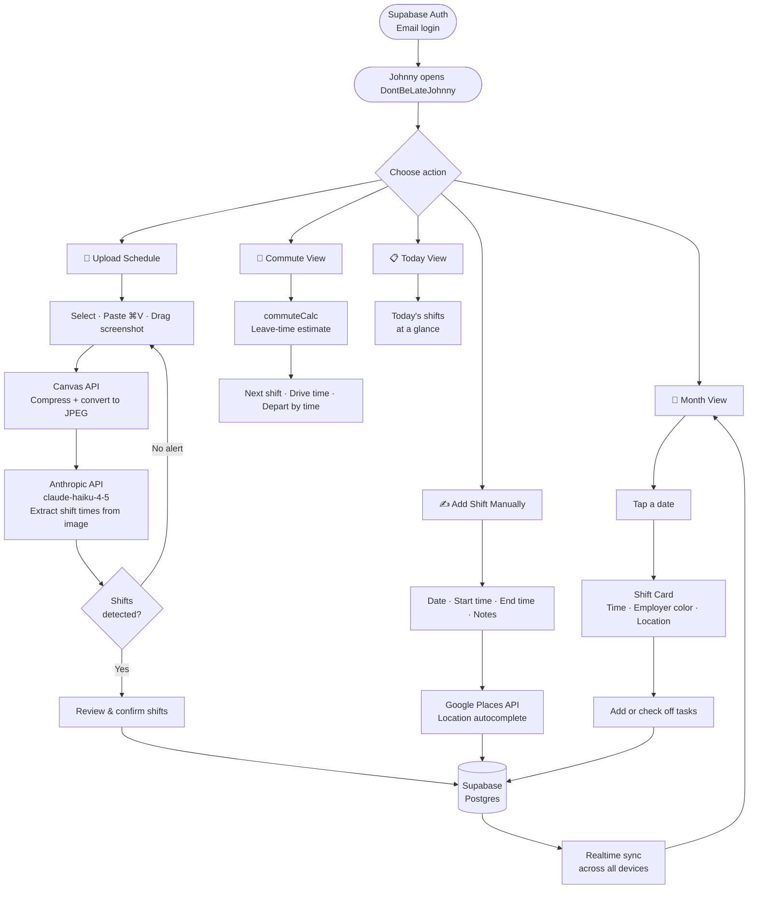

# Project 3: Persons Required

 
# 🚑 The Ambulance Sticker Problem: Six Roles, Three Hospitals, One Very Messy System
 
> *"The schedule tells him where to be. This tool tells him whether he can also be everything else."*
 
---

# Design Argument & Research
 
This is a pre-AI UX design thesis documenting a real person, a real problem, and a grounded definition of what being "helped" actually means. Every claim here comes directly from interviews, screenshots, observations, or documented behavior. Nothing is made up for the sake of the project.
 
---
 
# Section 1: The Person
 
**Johnny Truong** is a 35-year-old Vietnamese-American man living outside Nashville, Tennessee.
 
On any given week, he’s balancing shifts across three different hospital systems while also juggling multiple other responsibilities:
 
| Role | Employer |
|---|---|
| Pharmacist | Publix |
| Pharmacist | Vanderbilt Hospital |
| Pharmacist | Nashville General Hospital |
| Real Estate Agent | Independent |
| Nail Shop Co-Owner | Independent |
| Father | Family |
 
He isn’t bad at organization. The problem is that none of the systems he relies on were designed to work together. Every employer has its own scheduling platform, login flow, and two-factor authentication. None of them sync. Johnny ends up managing the gaps between all of them manually.
 
### By the Numbers
 
| | |
|---|---|
| **6** | Concurrent roles across employers |
| **3** | Separate hospital scheduling systems |
| **1–2 months** | How far ahead schedules are usually sent |
 
---
 
# Section 2:  The Problem
 
Johnny struggles to manage a constantly changing schedule across multiple employers, all using separate systems, separate logins, and separate verification steps. Even just seeing everything in one place becomes a task on its own.
 

## Research Documentation
 

### In His Own Words
 
> *"Different logins. Different passwords. Two factor authentications."*
> — On what's hardest about switching between hospital systems
 
> *"When things change last minute I have to basically paint/photoshop my shit lol."*
> — On schedule changes
 
> *"Ease, frequency of changes, lack of drive to look for something better."*
> — On why he sticks with screenshots
 
> *"Habit."*
> — The single word that explains the whole system
 
> *"There's probably a calendar app for all this. I just haven't had the time to look."*
> — On awareness of alternatives
 
> *"My problems revolve around commute times and making sure I got the necessary time/bandwidth to take care of the things I need to do."*
> — On what the actual problem is underneath everything else

### His Current System
```
Screenshot Publix calendar (Science Provider app)
  → Manually place 🚑 emoji stickers on dates for Vanderbilt + Nashville General
    → Mark days off with X
      → Text himself task reminders
        → Cross them out in the iMessage thread
        
```

### Observed Artifacts
 
**The Calendar**  
Johnny screenshots his Publix scheduling app, then manually places ambulance emoji stickers over dates to mark Vanderbilt and Nashville General shifts. Days off get hand-drawn X’s. This becomes his main scheduling interface.

<table>
<tr>
<td></td>
<td></td>
</tr>
</table>
 
**The Task System**  
For reminders, Johnny texts himself and edits or crosses things out directly in the message thread. No dedicated productivity app. No connection between tasks and the actual shifts they relate to.
 
### Pain Points
 
| # | Pain Point |
|---|---|
| 01 | The hardest mental task every week is **remembering which facility he’s commuting to**  not the pharmacy work itself, just the logistics around it |
| 02 | He only checks schedules **once a week or right before a shift** because checking more often means logging into three different systems repeatedly |
| 03 | Last-minute schedule changes break the entire workaround system — screenshots become outdated and need manual edits |
| 04 | Tasks live completely separate from scheduling — **there’s no connection between what he needs to do and when he realistically has time to do it** |

### All Direct Quotes
 
| Quote | Context |
|---|---|
| *"Different logins. Different passwords. Two factor authentications."* | On switching between hospital systems |
| *"When things change last minute I have to basically paint/photoshop my shit lol."* | On schedule changes |
| *"Ease, frequency of changes, lack of drive to look for something better."* | On why he uses screenshots |
| *"Habit."* | The single-word explanation |
| *"There's probably a calendar app for all this. I just haven't had the time to look."* | On awareness of alternatives |
| *"Remembering which facility im going to."* | His biggest source of mental effort |
| *"I text myself reminders/lists and edit or cross out."* | His task management system |
| *"It would be cool to have something that I can differentiate my days then when I click on the day I can add tasks to do and cross them off as I go."* | His direct feature request |
| *"My problems revolve around commute times and making sure I got the necessary time/bandwidth to take care of the things I need to do."* | The real underlying problem |
 
---
 
## Section 3 : The Listening Plan
 
This wasn’t approached like a one-and-done interview. Johnny’s situation changes weekly. Shifts move around, commutes vary, and new friction points show up constantly.
 
### Research Cadence
 
| Format | Frequency | Purpose |
|---|---|---|
| Text check-ins | 3× per week | Capture real-time friction, updates, and recurring pain points |
| Scheduled call | 1× per week | Longer conversations around root problems and feature feedback |
| Natural observation | Ongoing | Observing how he actually interacts with schedules after shifts or during downtime |
 
### Research Ethics
-  Clear consent obtained before research began
-  Permission granted to take notes and reference quotes
-  Permission granted to use his information for this project
-  Research conducted during natural moments, not staged ones
---
 
#  Section 4 : What Help Looks Like
 
Johnny defined this himself without prompting:
 
> *"It would be cool to have something that I can differentiate my days then when I click on the day I can add tasks to do and cross them off as I go."*
> — Johnny Truong, direct feature request
 
> *"Less stressful? Cause planned out further ahead and more accurate if it could update all 3 schedules in real time. Accuracy. Editable. Customizable. Fun."*
> — On what a better system would actually feel like
 
### Defensible Definition of "Helped"
 
**Johnny feels helped when he can open one screen the night before work and immediately know  without logging into three systems or mentally piecing things together  where he’s working, how long the commute will take, and whether he realistically has time for anything else that day.**
 
Tasks live directly on the day they belong to. If a shift changes, the schedule updates automatically. No more photoshopping ambulance stickers at 10pm.
 
---

# Section 5 : The Thesis

**Johnny Truong doesn't have a scheduling problem. He has a translation problem  six roles, three hospital systems, and no single surface that speaks all of them at once. Every workaround he's built, the ambulance stickers, the self-texts, the photoshopped screenshots, is evidence of someone filling a gap that software left open. This project eliminates that gap by turning raw schedule screenshots into structured, unified calendar events — with commute awareness, day-level tasks, and employer context built in  so that the night before a shift, Johnny opens one screen and already knows everything he needs to know.**

---
 
# Section 6 : The Approach
 
A **screenshot-to-schedule calendar app** that uses character recognition to pull shift details from uploaded screenshots and automatically convert them into structured events across multiple calendars in one unified view.
 
### Core Features
 
| Feature | Grounded In |
|---|---|
| 📸 **Screenshot → OCR → Auto-populate** | *"Sounds annoying to manually add lol"* + his entire workaround is screenshot-based |
| 🏷️ **Employer color tags on month view** | *"Differentiate my days"* |
| 📅 **Day/shift card with big time display** | *"When I click on the day"* + *"Yes to shift times"* |
| ✅ **Per-shift task checklist** | *"Add tasks to do and cross them off as I go"* |
| 🚗 **Commute-aware leave alert** | *"My problems revolve around commute times"* |
| 🔔 **OneSignal lock screen notification** | Commute alerts need to reach a locked screen |
| ↔️ **Drag-to-reschedule** | *"Paint/photoshop my shit"* when things change |
| 📱 **Installable to iPhone home screen** | He checks it while walking between locations |
 
---
 
# Section 7 : Position Going In
 
The core position: **eliminate the manual workaround loop**  the screenshots, stickers, edits, and mental tracking  by turning raw schedule information into structured, usable calendar events automatically. The user shouldn’t have to manage the same schedule twice.
 
### Assumptions & Open Questions
 
| | |
|---|---|
|  **Open Question** | Can a lightweight app reliably support real-time commute notifications? This is where trust matters most — if notifications fail, the system fails |
|  **Technical Concern** | What happens if the app is offline? Missing commute alerts in a time-sensitive workflow could mean missing shifts entirely |
|  **Design Assumption** | Johnny already assumes a better solution probably exists. The issue isn’t awareness — it’s having enough time or energy to set something complicated up |
|  **Success Metric** | Johnny stops texting himself reminders. Johnny stops editing screenshots. Johnny checks one screen instead of three. Observable. Measurable. |
 
---
 
# Section 8 : What This Project Is Not
 
- **Not an offline-first machine** — Internet access is required for real-time traffic, commute alerts, and schedule syncing. Offline support is currently outside scope.
- **Not a replacement for employer systems** — Cannot remove login requirements, two-factor authentication, or hospital restrictions imposed by Vanderbilt, Nashville General, or Publix. The tool works *around* existing systems, not *through* them.
- **Not a generic productivity app** — This is designed specifically around Johnny’s multi-employer, multi-commute lifestyle. Not productivity for everyone — support for one documented workflow.
- **Not speculative** — Every feature connects directly back to something Johnny said or something observed in real behavior. If there’s no evidence for it, it doesn’t belong here.

---


# Section 9 : Platform Rationale
 
**React + Vite + Tailwind PWA  deployed on Github Pages installable to iPhone home screen by PWA, Progressive Web App.**
 
Every choice traces back to Johnny:
 
| Decision | Why |
|---|---|
| **PWA not native iOS** | Outside build constraints. PWA installs to home screen, works fullscreen, sends lock screen notifications via OneSignal on iOS 16.4+ |
| **Responsive, not mobile-only** | He uses his laptop at work to set up his week. He uses his iPhone while walking between locations. Two modes, one app. |
| **React + Vite** | Component structure maps directly to the UI: month view, shift cards, task lists — each discrete, stateful |
| **Tailwind** | He said *"fun, customizable, colorful."* Tailwind makes rapid visual iteration fast |
| **Githubpages** | One-click deploy from GitHub. Johnny gets a URL, opens in Safari, adds to home screen in under a minute |
| **OneSignal** | Commute alerts need to hit a locked screen. OneSignal handles server-side scheduling without a backend |
 
> *Johnny manages his schedule on his laptop at work and checks it on his iPhone while walking  the app needs to be fully functional on both, with a setup mode on desktop and a glance mode on mobile.*
*Primary Research conducted April-May 2026 · UX Research Thesis*

---

# Section 10 : Prototype Style

 
## Visual Style
 
| Decision | Source |
|---|---|
| **Dark mode only** | *"Dark mode"* — his direct answer |
| **Bold distinct color per employer** | *"Different colors for different jobs would be nice"* |
| **Shift times as visual hero** | *"Yes to shift times"* |
| **Fun, personality-forward** | Said *"fun."* Has never used a calendar app before no competing aesthetic to match |
| **No manual entry as default** | *"Sounds annoying to manually add lol"* |

### Employer Colors
 
| Employer | Color | Hex |
|---|---|---|
| 🟢 Publix | Green | `#00A651` |
| 🟡 Vanderbilt | Gold | `#CFB87C` |
| 🔵 Nashville General | Blue | `#2D6DB5` |
| ⚫ Personal / Off | Gray | `#3A3A3A` |

### Typography
 
| Use | Font | Weight |
|---|---|---|
| App name / display | Syne | 800 |
| Shift times (hero element) | Syne | 800 · 42px minimum |
| Employer names / headings | Syne | 700 |
| Body / UI / labels | Space Grotesk | 400 · 500 |


---

# Section 11 : User Testing
Johnny did not feel comfortable having his face photographed or recorded during user testing. To respect his privacy and maintain research ethics, documentation focused on screen recordings, interaction notes, interface observations, direct quotes, and workflow behaviors rather than identifiable imagery of the participant.

## First Click Through

### User Testing Goals

1. Test whether Johnny can quickly understand his full schedule in one place without relying on screenshots or multiple apps.
2. Evaluate whether the prototype reduces stress and mental effort around commuting, shift tracking, and task management.
3. Identify usability issues involving navigation, schedule importing, and understanding interactions across desktop and mobile.
4. Measure how effectively employer colors, shift cards, and task features support Johnny’s real-world workflow.
5. Observe which features build or break trust, especially around OCR accuracy, schedule updates, and notifications.

### Task 1 Check Tomorrow’s Schedule

**Prompt**
Open the app and figure out where you are working tomorrow, what time your shift starts, and when you would need to leave.

**Questions**
What information did you notice first?
Was anything confusing when trying to understand tomorrow’s schedule?
Did the commute information feel helpful?
Would this be faster than your current screenshot method?

### Task 2 Check Tomorrow’s Schedule

**Prompt**
Use the calendar to explain what your upcoming week looks like across all jobs.

**Questions**
1. Was it easy to tell which shifts belonged to which employer?
2. Which days felt the busiest to you?
3. Did the colors help you mentally organize the week?
4. Was there any information you expected but couldn’t find?

### Task 3 Add and Complete a Task

**Prompt**
Add a realistic reminder or task to one of your workdays, then mark it as completed.

**Questions**
1. Is attaching tasks to a specific day feel natural?
2. Would you use this instead of texting yourself reminders?
3. What kinds of tasks would you realistically add here?
4. Did anything about the task system feel unnecessary or missing?

### Task 4 Handle a Schedule Change

**Prompt**
Pretend one of your hospital shifts changed last minute. Show how you would update or manage that change in the app.

**Questions**
1. What was the first thing you tried to do?
2. Did this feel easier than editing screenshots manually?
3. Would you trust the app to stay accurate after schedule changes?
4. What would make you trust the system more?

### Task 5 Mobile Glance Test

**Prompt**
Imagine you are walking between locations and quickly checking the app on your phone.

**Questions**
1. What information stood out immediately on mobile?
2. Did anything feel difficult to access quickly?
3. Would you realistically check this while on the move?
4. After using the prototype, what still feels stressful or unresolved about scheduling?

### User Testing Results

| Quote | Context |
|---|---|
| *"I like that I can finally see everything in one place instead of bouncing between apps."* | Positive reaction to unified scheduling |
| *"The colors actually help more than I thought they would."* | Reaction to employer color coding |
| *"The commute part is actually useful because that’s what stresses me out the most."* | Positive feedback on commute-aware features |
| *"I like that the shift times are big because that’s the main thing I care about."* | Reaction to visual hierarchy and readability |
| *"This already feels less chaotic than my current system."* | Overall emotional reaction to prototype organization |
| *"I kept looking for a navigation bar on desktop."* | Difficulty navigating desktop experience |
| *"I didn’t know where to go next on laptop because there wasn’t a clear menu."* | Navigation confusion during testing |
| *"Some of the screenshots imported correctly, but some shift times got messed up."* | OCR inconsistency across schedule screenshots |
| *"The screenshots that had weird formatting confused the scanner a little."* | OCR struggled with different hospital layouts |
| *"I still want a faster way to fix mistakes if the schedule imports wrong."* | User concern about OCR correction workflow |

Insert images of screenshots not working table here claude

User testing focused on observing Johnny using the prototype to manage shifts across Publix, Vanderbilt, and Nashville General. Several features worked immediately without explanation. Johnny responded positively to the unified calendar view, employer color coding, and large shift-time displays, saying the app felt “less chaotic” than his current screenshot system. The commute-aware information was especially useful because commute planning is one of his main stress points. He also naturally understood the task checklist system and preferred having reminders attached directly to workdays instead of texting himself notes separately.

Testing also revealed important usability problems. On desktop, Johnny repeatedly searched for a navigation bar and became unsure where to go next because navigation was unclear. OCR schedule importing was inconsistent depending on screenshot formatting — some schedules imported correctly while others misread shift times or layout information. These issues reduced trust in the system and showed the need for clearer desktop navigation, stronger OCR handling for different hospital schedule layouts, and easier ways to manually correct imported schedule errors.

### Key Changes Needed After First Round Testing

- Add a persistent desktop navigation bar to improve orientation and usability
- Improve navigation clarity between calendar, task, and schedule views
- Add clearer visual indicators for clickable interactions and navigation flow
- Improve OCR handling for inconsistent hospital screenshot layouts
- Add better error detection when shift times import incorrectly
- Create a faster manual correction workflow after OCR importing
- Improve feedback states so users know schedules imported successfully
- Increase visibility of commute and leave-time information
- Continue optimizing the app for fast “glance-based” schedule checking
- Reduce friction between uploading screenshots and viewing organized schedules

---

## Second Click Through

### User Testing Goals

1. Evaluate whether navigation improvements reduced confusion on desktop.
2. Test whether OCR importing became more reliable across different screenshot layouts.
3. Measure whether the app feels closer to replacing Johnny’s screenshot workflow.
4. Observe which features Johnny relies on most during quick schedule checks.
5. Identify remaining trust issues involving imported schedules and updates.

### Task 1 Desktop Navigation Test

**Prompt**  
Use the desktop version of the app to check tomorrow’s shift and navigate between different sections of the app.

**Questions**
1. Was it easier to move through the app this time?
2. Did the navigation feel clearer compared to the first version?
3. Were there any moments where you still felt lost?
4. What section did you naturally go to first?

### Task 2 OCR Screenshot Import Test

**Prompt**  
Upload multiple schedule screenshots from different hospital systems and review the imported shifts.

**Questions**
1. Did the screenshots import more accurately this time?
2. Were any shifts or times still incorrect?
3. Was it easier to notice import mistakes?
4. How would you want to fix incorrect schedule information?

### Task 3 Commute & Leave Time Test

**Prompt**  
Check your next upcoming shift and explain when you would need to leave.

**Questions**
1. Did the leave feature feel useful?
2. Was commute information easier to notice this time?
3. Would you realistically rely on this feature daily?
4. What other commute information would help you?

### Task 4 Personalization Test

**Prompt**  
Review the employer labels and colors used throughout the app.

**Questions**
1. Did the employer colors still help organize your schedule?
2. Would customizable employer logos or icons improve the experience?
3. Did the schedule feel more personal to your workflow now?
4. Was there anything visually confusing?

### Task 5 Quick Mobile Check Test

**Prompt**  
Imagine you are walking between locations and checking the app quickly on your phone.

**Questions**
1. What information did you notice first?
2. Did the app feel faster to understand this time?
3. What feature mattered most during quick checking?
4. Does this feel closer to replacing your current workaround system?

### User Testing Results

| Quote | Context |
|---|---|
| *"I like the leave feature."* | Positive reaction to commute-aware leave alerts |
| *"The navigation makes more sense now."* | Improved desktop usability after adding navigation |
| *"It feels easier to understand where I’m supposed to be."* | Reaction to unified schedule organization |
| *"The screenshots imported better this time."* | Improvement in OCR schedule importing |
| *"I like seeing everything together without checking three apps."* | Positive response to consolidated scheduling |
| *"Maybe make customizable logos where you can upload and change the logos."* | Suggestion for employer personalization |
| *"I still want a faster way to fix imported mistakes."* | Remaining frustration with OCR corrections |
| *"Some screenshots still read differently depending on the layout."* | Continued OCR inconsistency across systems |
| *"I mostly just care about the next shift and when I should leave."* | Observation about glance-based usage behavior |
| *"This feels closer to something I’d actually use every day."* | Overall reflection after second round testing |

The second round of testing showed clear improvement in navigation clarity and schedule readability. Johnny adapted to the updated desktop navigation more naturally and relied heavily on the leave-time feature and unified schedule overview during testing. OCR importing also improved, with more screenshots reading successfully compared to the first round of testing. The prototype felt closer to replacing his current workaround system because it reduced the need to mentally combine information from multiple apps.

However, testing still revealed ongoing trust issues around OCR consistency. Certain hospital screenshot layouts continued to produce inaccurate imports, especially when formatting varied significantly. Johnny also expressed interest in more personalization features, such as customizable employer logos. Another important observation was that he primarily used the app as a fast “next shift” checking tool rather than a deep planning interface, reinforcing the importance of glanceability, speed, and accuracy over feature complexity.

### Key Changes Needed After Second Round Testing

- Improve OCR handling for inconsistent screenshot layouts across hospital systems
- Add a faster manual correction flow for imported schedule mistakes
- Add customizable employer logos and icons
- Increase emphasis on “next shift” and leave-time visibility
- Continue simplifying mobile glance interactions
- Improve trust indicators for successful schedule imports and updates

---

# Section 12 : App Architecture & User Flow


```mermaid
flowchart TD
    AUTH([Supabase Auth\nEmail login]) --> A

    A([Johnny opens DontBeLateJohnny]) --> B{Choose action}

    B --> C[📅 Month View]
    B --> D[📸 Upload Schedule]
    B --> E[✍️ Add Shift Manually]
    B --> F[🚗 Commute View]
    B --> G[📋 Today View]

    D --> D1[Select · Paste ⌘V · Drag screenshot]
    D1 --> D2[Canvas API\nCompress + convert to JPEG]
    D2 --> D3[Anthropic API\nclaude-haiku-4-5\nExtract shift times from image]
    D3 --> D4{Shifts\ndetected?}
    D4 -->|Yes| D5[Review & confirm shifts]
    D4 -->|No alert| D1
    D5 --> DB

    E --> E1[Date · Start time · End time · Notes]
    E1 --> E2[Google Places API\nLocation autocomplete]
    E2 --> DB

    C --> C1[Tap a date]
    C1 --> C2[Shift Card\nTime · Employer color · Location]
    C2 --> C3[Add or check off tasks]
    C3 --> DB

    F --> F1[commuteCalc\nLeave-time estimate]
    F1 --> F2[Next shift · Drive time · Depart by time]

    G --> G1[Today's shifts\nat a glance]

    DB[(Supabase\nPostgres)] --> SYNC[Realtime sync\nacross all devices]
    SYNC --> C
```
